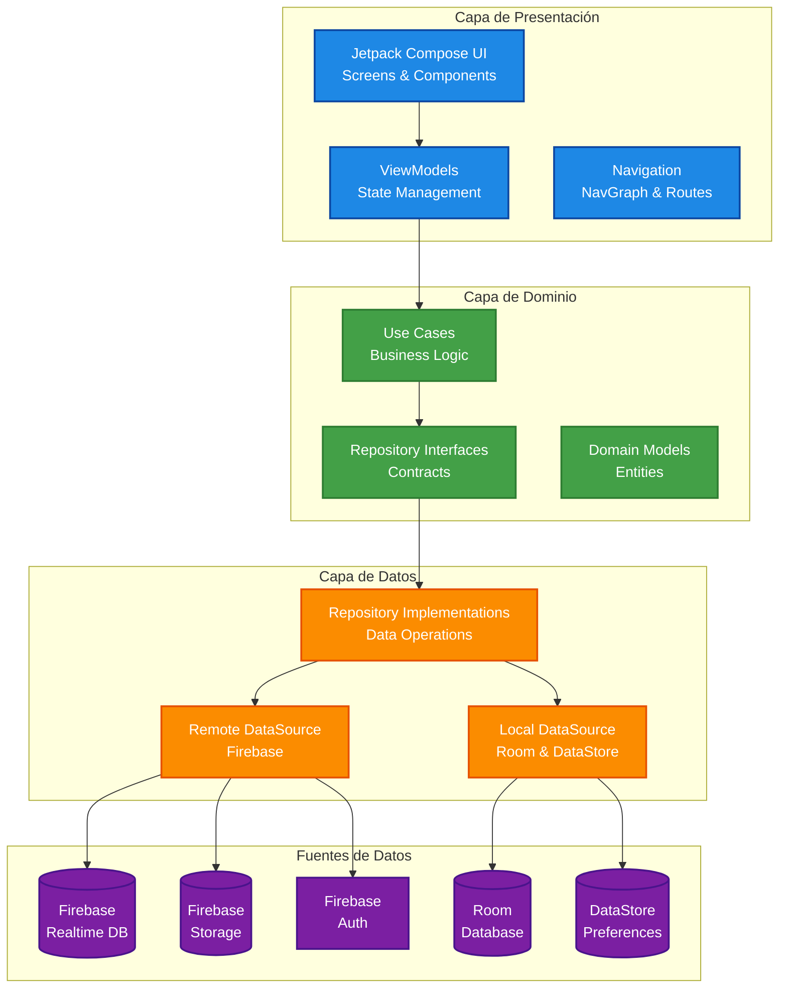
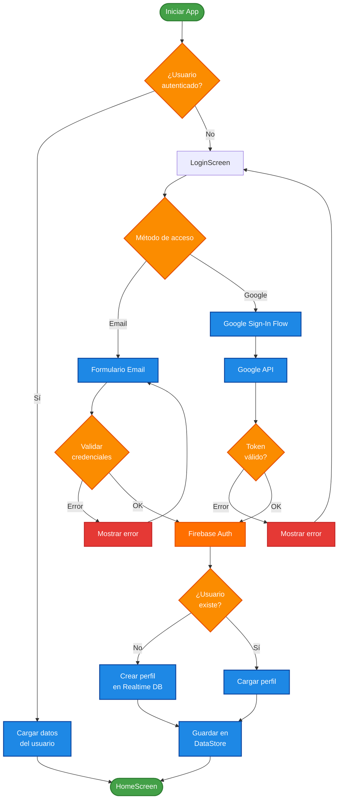
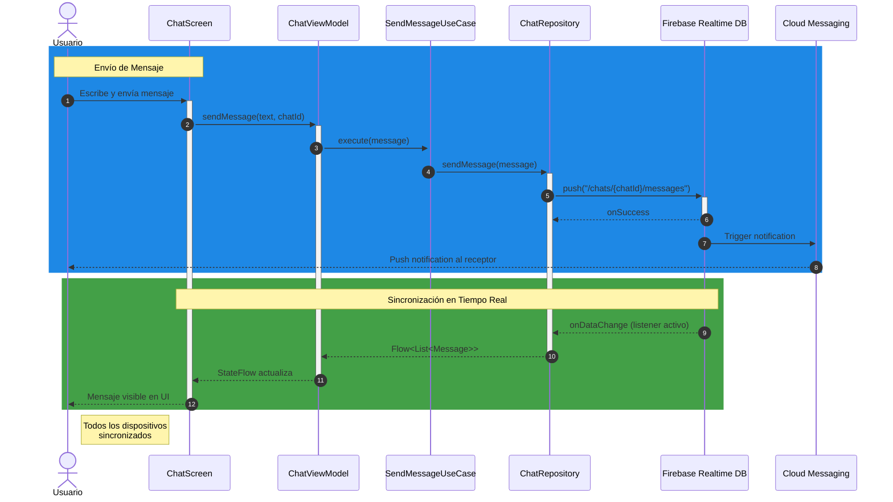
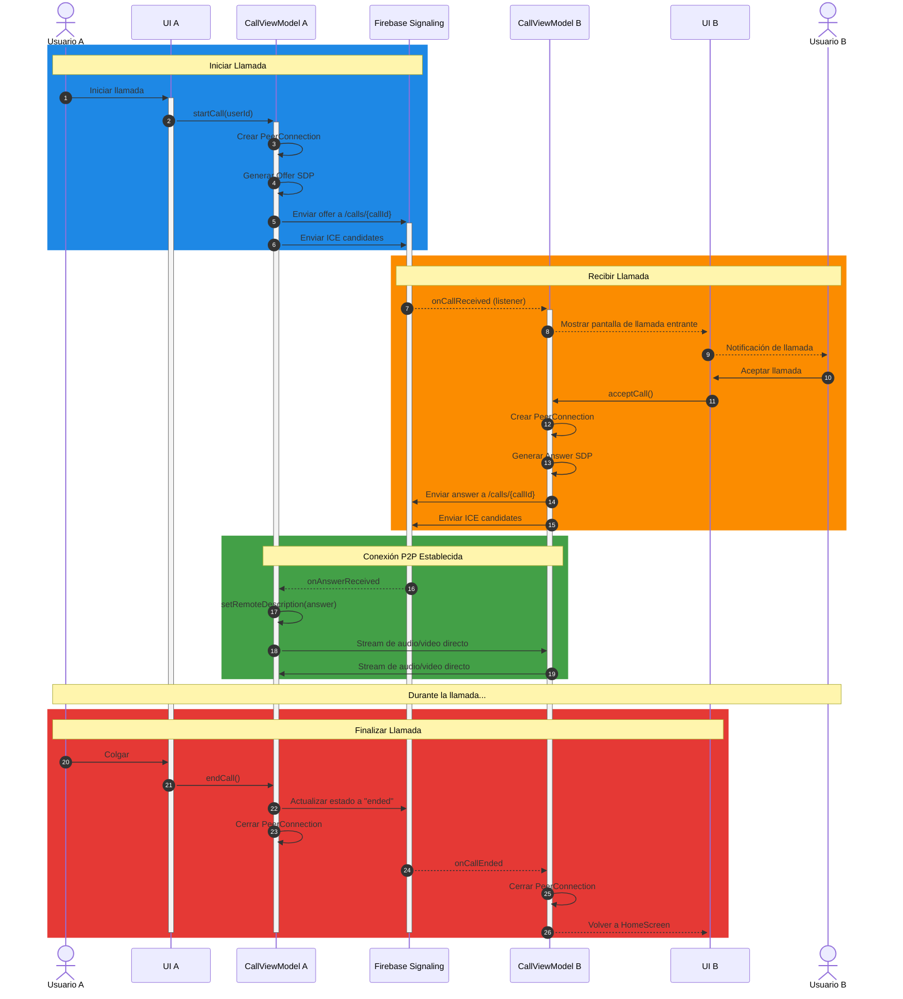
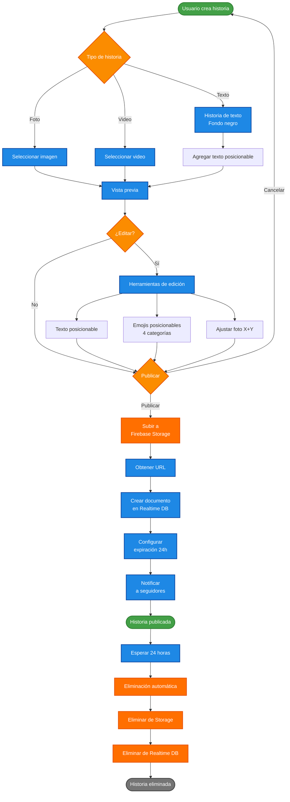
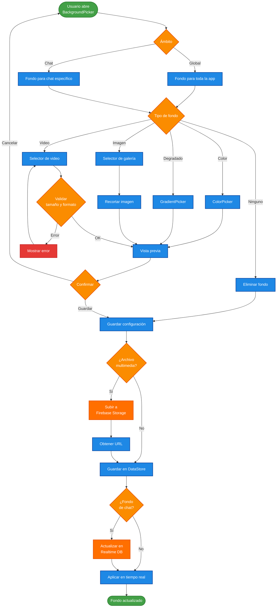

# NexusChat

<div align="center">


**Aplicación de mensajería instantánea nativa para Android**  
Construida con Kotlin y Jetpack Compose

[Características](#características) • [Arquitectura](#arquitectura) • [Instalación](#instalación) • [Documentación](#documentación)

</div>

---

## Descripción

NexusChat es una aplicación de mensajería instantánea desarrollada nativamente para Android utilizando Kotlin y Jetpack Compose. Implementa Clean Architecture con el patrón MVVM para garantizar escalabilidad y mantenibilidad del código.

La aplicación ofrece funcionalidades completas de mensajería en tiempo real mediante Firebase Realtime Database, llamadas de voz y video con WebRTC, historias efímeras con duración de 24 horas, y un sistema de personalización que incluye temas, fondos personalizados y configuraciones de interfaz.

**Compatibilidad:** Android 8.0 (API 26) hasta Android 16 (API 36)

---

## Características

### Mensajería
- Chat en tiempo real con sincronización instantánea
- Mensajes de texto, voz, imágenes, videos y archivos
- Indicadores de estado: enviado, entregado, leído
- Indicador de escritura en tiempo real
- Respuestas rápidas deslizando mensajes
- Reacciones con emojis
- Chats grupales con gestión de miembros
- Búsqueda de mensajes y conversaciones
- Fijar, silenciar y archivar conversaciones

### Historias
- Publicación de fotos, videos y texto
- Caducidad automática a las 24 horas
- Visualización con barra de progreso
- Reacciones y respuestas directas
- Lista de visualizaciones con timestamps
- Editor con emojis y texto posicionable
- Ajuste bidimensional de imágenes

### Llamadas
- Llamadas de voz y videollamadas
- Comunicación P2P mediante WebRTC
- Señalización a través de Firebase
- Calidad adaptativa según conexión
- Controles: silenciar, altavoz, cambiar cámara

### Personalización
- 15 temas de color predefinidos
- Fondos personalizados (imagen, video, color, degradado)
- Fondos independientes por conversación
- Configuración de tamaños de fuente
- Modo oscuro
- Navegación por gestos

### Notificaciones
- Notificaciones push con Firebase Cloud Messaging
- Agrupación por conversación
- Respuesta rápida desde notificaciones
- Marcar como leído sin abrir la app

---

## Arquitectura

NexusChat implementa **Clean Architecture** dividida en tres capas principales con separación clara de responsabilidades.

### Diagrama de Arquitectura General



### Capas de la Arquitectura

#### 1. Capa de Presentación
- **Jetpack Compose**: Interfaz de usuario declarativa
- **ViewModels**: Gestión de estado con StateFlow
- **Navigation Component**: Navegación entre pantallas
- **Theme System**: Sistema de temas y estilos

#### 2. Capa de Dominio
- **Use Cases**: Lógica de negocio encapsulada
- **Repository Interfaces**: Contratos de acceso a datos
- **Domain Models**: Entidades del dominio

#### 3. Capa de Datos
- **Repositories**: Implementación de acceso a datos
- **Remote DataSource**: Integración con Firebase
- **Local DataSource**: Caché local con Room y DataStore

---

## Flujos de la Aplicación

### Flujo de Autenticación



### Flujo de Mensajería en Tiempo Real



### Flujo de Llamadas WebRTC



### Flujo de Historias



### Flujo de Personalización de Fondos



---

## Stack Tecnológico

| Componente | Tecnología | Versión |
|-----------|-----------|---------|
| UI Framework | Jetpack Compose BOM | 2025.04.01 |
| Lenguaje | Kotlin | 100% |
| Arquitectura | Clean Architecture + MVVM | - |
| Base de datos | Firebase Realtime Database | BOM 33.7.0 |
| Almacenamiento | Firebase Storage | BOM 33.7.0 |
| Autenticación | Firebase Auth | BOM 33.7.0 |
| Mensajería push | Firebase Cloud Messaging | BOM 33.7.0 |
| Inyección de dependencias | Hilt | 2.52 |
| Carga de imágenes | Coil | 3.1.0 |
| Reproductor de video | ExoPlayer media3 | 1.3.1 |
| Llamadas | Stream WebRTC Android | 1.1.3 |
| Caché local | Room | - |
| Preferencias | DataStore | - |
| Corrutinas | Kotlin Coroutines + Flow | 1.9.0 |
| SDK mínimo | Android 8.0 (Oreo) | API 26 |
| SDK objetivo | Android 16 | API 36 |

---

## Estructura del Proyecto

```
app/src/main/java/com/Azelmods/App/
│
├── data/                           # Capa de Datos
│   ├── api/                        # Servicios API
│   │   └── AzelAIApiService.kt
│   ├── repository/                 # Implementaciones de repositorios
│   │   ├── ChatRepository.kt
│   │   ├── UserRepository.kt
│   │   ├── StoryRepository.kt
│   │   ├── CallRepository.kt
│   │   └── ChatBackgroundRepository.kt
│   ├── remote/                     # Fuentes de datos remotas
│   │   └── FirebaseDataSource.kt
│   ├── local/                      # Fuentes de datos locales
│   │   ├── RoomDatabase.kt
│   │   └── DataStoreManager.kt
│   ├── preferences/                # Preferencias persistentes
│   │   ├── ThemePreferences.kt
│   │   └── UserPreferences.kt
│   └── model/                      # Modelos de datos
│       ├── User.kt
│       ├── Message.kt
│       ├── Story.kt
│       └── Call.kt
│
├── domain/                         # Capa de Dominio
│   ├── repository/                 # Interfaces de repositorios
│   │   ├── IChatRepository.kt
│   │   ├── IUserRepository.kt
│   │   └── IStoryRepository.kt
│   └── usecase/                    # Casos de uso
│       ├── SendMessageUseCase.kt
│       ├── CreateStoryUseCase.kt
│       └── StartCallUseCase.kt
│
├── ui/                             # Capa de Presentación
│   ├── screens/                    # Pantallas
│   │   ├── chat/
│   │   │   ├── ChatScreen.kt
│   │   │   └── ChatViewModel.kt
│   │   ├── stories/
│   │   │   ├── StoriesScreen.kt
│   │   │   └── StoriesViewModel.kt
│   │   ├── calls/
│   │   │   ├── CallsScreen.kt
│   │   │   └── ActiveCallScreen.kt
│   │   └── settings/
│   │       └── SettingsScreen.kt
│   ├── components/                 # Componentes reutilizables
│   │   ├── AppBackground.kt
│   │   └── VoiceRecorder.kt
│   ├── theme/                      # Sistema de temas
│   │   ├── Theme.kt
│   │   ├── Color.kt
│   │   └── Type.kt
│   └── navigation/                 # Navegación
│       ├── NavGraph.kt
│       └── Screen.kt
│
├── di/                             # Inyección de Dependencias
│   ├── AppModule.kt
│   └── RepositoryModule.kt
│
├── services/                       # Servicios Android
│   ├── CallService.kt
│   └── NexusFirebaseMessagingService.kt
│
└── MainActivity.kt
```

---

## Instalación

### Requisitos Previos

- Android Studio Hedgehog (2023.1.1) o superior
- JDK 17 o superior
- Android SDK API 36
- Cuenta de Firebase (gratuita)

### Clonar y Compilar

```bash
# Clonar el repositorio
git clone https://github.com/AzelMods677/NexusChat.git
cd NexusChat

# Compilar APK de depuración
./gradlew assembleDebug

# Instalar en dispositivo conectado
./gradlew installDebug

# Compilar APK de lanzamiento
./gradlew assembleRelease
```

**Salida:** `app/build/outputs/apk/debug/app-debug.apk`

---

## Configuración de Firebase

### Paso 1: Crear Proyecto

1. Accede a [Firebase Console](https://console.firebase.google.com/)
2. Crea un nuevo proyecto y agrega una aplicación Android
3. Nombre del paquete: `com.Azelmods.App`
4. Descarga `google-services.json` y colócalo en el directorio `app/`

### Paso 2: Habilitar Servicios

- **Realtime Database**: Modo de prueba o producción
- **Storage**: Modo de prueba o producción
- **Authentication**: Email/Contraseña + Google Sign-In
- **Cloud Messaging**: Se habilita automáticamente

### Paso 3: Reglas de Base de Datos

```json
{
  "rules": {
    ".read": "auth != null",
    ".write": "auth != null",
    "users": {
      "$uid": {
        ".read": "auth != null",
        ".write": "auth.uid === $uid"
      }
    },
    "chats": {
      "$chatId": {
        ".read": "auth != null",
        ".write": "auth != null"
      }
    },
    "stories": {
      ".read": "auth != null",
      "$storyId": {
        ".write": "auth != null && (!data.exists() || data.child('userId').val() === auth.uid)"
      }
    }
  }
}
```

### Paso 4: Reglas de Storage

```
rules_version = '2';
service firebase.storage {
  match /b/{bucket}/o {
    match /{allPaths=**} {
      allow read: if request.auth != null;
      allow write: if request.auth != null
                   && request.resource.size < 10 * 1024 * 1024;
    }
  }
}
```

### Paso 5: Google Sign-In

```bash
keytool -list -v -keystore ~/.android/debug.keystore -alias androiddebugkey -storepass android -keypass android
```

Agrega el SHA-1 resultante en **Firebase Console → Configuración del proyecto → Huella digital**.

---

## Registro de Cambios

### v1.0.0 - Lanzamiento Inicial (2026)

#### Funcionalidades Principales
- Mensajería en tiempo real con Firebase Realtime Database
- Historias con caducidad de 24 horas
- Llamadas de voz y video con WebRTC
- Autenticación Firebase (Email + Google Sign-In)
- Notificaciones push con Firebase Cloud Messaging

#### Sistema de Personalización
- 15 temas de color predefinidos
- Fondos personalizados (imagen, video, color, degradado)
- Fondos independientes por conversación
- Configuración de tamaños de fuente
- Modo oscuro

#### Historias
- Selector de emojis con 4 categorías
- Emojis y texto posicionables
- Ajuste bidimensional de fotos
- Grid de 8 columnas para emojis

#### Llamadas
- Permisos actualizados para Android 12+
- Verificación de permisos en tiempo real
- Comunicación P2P con WebRTC

#### Mensajería
- Envío de videos optimizado
- Mensajes de voz con visualización de forma de onda
- Soporte mejorado para teclado

#### Mejoras Técnicas
- Arquitectura Clean con MVVM
- Material Design 3
- Visor de fotos con zoom
- Recorte de imágenes

---

## Roadmap

### Próximas Funciones

- Bot interno con respuestas automáticas
- Gestión avanzada de grupos
- Creador de stickers personalizado
- Sistema de respaldo y restauración

---

## Contribuir

1. Haz fork del proyecto
2. Crea una rama: `git checkout -b feature/nueva-funcionalidad`
3. Realiza tus cambios y haz commit: `git commit -m 'feat: descripción del cambio'`
4. Sube los cambios: `git push origin feature/nueva-funcionalidad`
5. Abre un Pull Request

### Guías de Contribución

- Kotlin 100%, Jetpack Compose para toda la UI
- Seguir Clean Architecture en todos los cambios
- Documentar funciones públicas con KDoc
- Verificar compilación sin errores antes de hacer commit

---

## Licencia

**MIT License** - Copyright (c) 2026 AzelMods677

Se concede permiso, de forma gratuita, a cualquier persona que obtenga una copia de este software para utilizarlo sin restricción, incluyendo los derechos a usar, copiar, modificar, fusionar, publicar, distribuir, sublicenciar y/o vender copias, sujeto a que el aviso de copyright anterior se incluya en todas las copias.

EL SOFTWARE SE PROPORCIONA "TAL CUAL", SIN GARANTÍA DE NINGÚN TIPO.

---

## Contacto

- **YouTube:** [@AzelModsx677](https://youtube.com/@AzelModsx677)
- **TikTok:** [@azelmodsx677](https://tiktok.com/@azelmodsx677)
- **Telegram:** [@AzelModsx67779](https://t.me/AzelModsx67779)

---

<div align="center">

**Si te gusta el proyecto, dale una estrella ⭐**

**Desarrollado por AzelMods677 © 2026**

</div>
