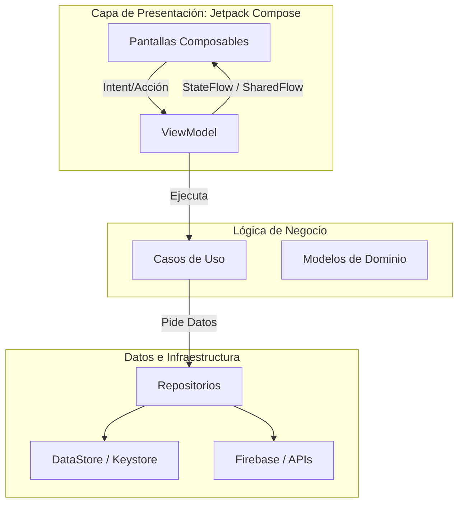
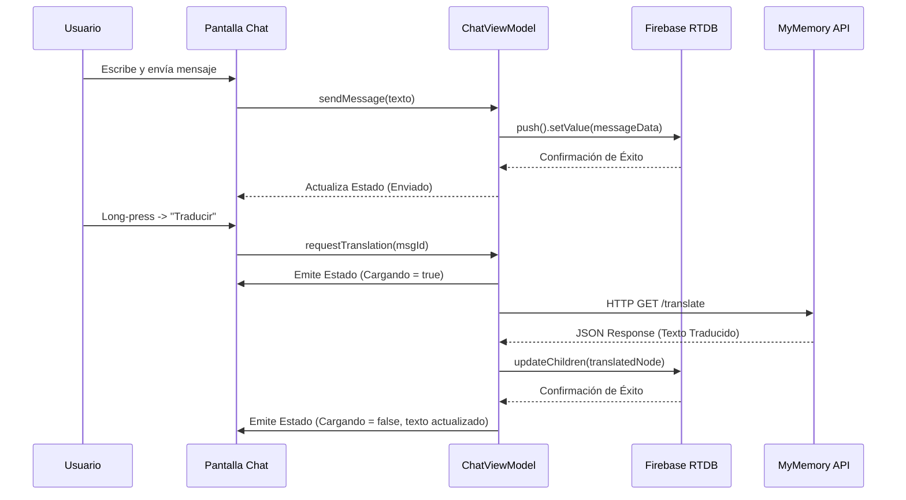
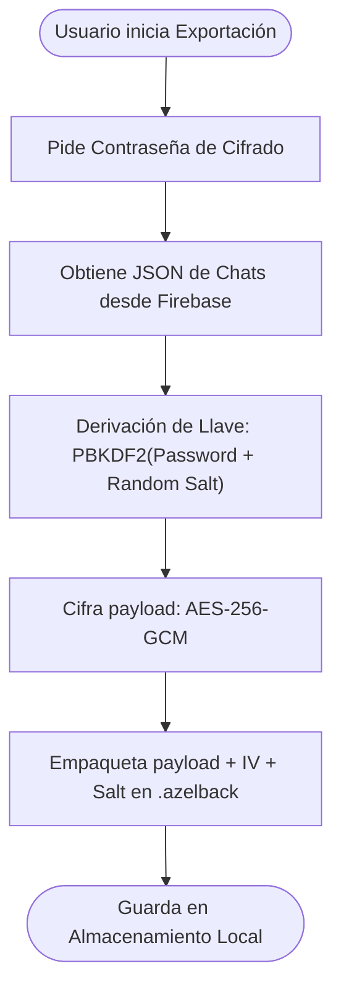
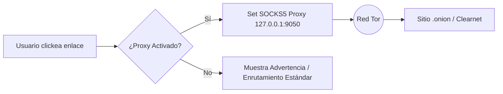

<p align="center">
  
</p>

<h1 align="center">Nexus Chat (Template para Devs)</h1>

<p align="center">
  <strong>Plantilla Profesional de Mensajería para Desarrolladores Android.</strong><br>
  Construida con Jetpack Compose, Firebase, Clean Architecture y Google Gemini AI.
</p>

<p align="center">
  
  
  
  
  
  
</p>

---

## 📖 Tabla de Contenidos
1. [Visión General](#-visión-general)
2. [Características Principales](#-características-principales)
3. [Arquitectura y Diseño del Sistema](#-arquitectura-y-diseño-del-sistema)
4. [Seguridad y Privacidad](#-seguridad-y-privacidad)
5. [Motor de Inteligencia Artificial (Azel AI)](#-motor-de-inteligencia-artificial-azel-ai)
6. [Estructura del Proyecto](#-estructura-del-proyecto)
7. [Esquema de Base de Datos Firebase](#-esquema-de-base-de-datos-firebase)
8. [Instalación y Configuración](#-instalación-y-configuración)
9. [Stack Tecnológico](#-stack-tecnológico)

---

## 🚀 Visión General

**Nexus Chat** es una plantilla Android lista para producción, diseñada como portafolio y referencia de desarrollo moderno. Va mucho más allá de una simple aplicación de chat, integrando paradigmas de alta seguridad, un entorno de ejecución de código, enrutamiento anónimo y un motor avanzado de Inteligencia Artificial.

Este repositorio sirve como **plantilla arquitectónica** para cualquier desarrollador que busque construir aplicaciones Android escalables, seguras y ricas en funciones utilizando los últimos estándares de la industria (Unidirectional Data Flow, Clean Architecture, Hilt, Coroutines).

---

## ✨ Características Principales

### 💬 Ecosistema de Mensajería
*   **Sincronización en Tiempo Real:** Impulsado por Firebase Realtime Database para entrega instantánea, indicadores de escritura y estado en línea.
*   **Caché de Medios:** Carga ultrarrápida de imágenes con **Coil 3**, garantizando un scroll fluido y uso óptimo de memoria.
*   **Traducción en Chat:** Traduce mensajes al instante sin salir de la conversación usando la API de MyMemory.
*   **Historias (Stories):** Comparte fotos y videos temporales con un visor y editor de historias integrado.

### 🛡️ Privacidad Sin Compromisos
*   **Integración Tor / Orbot:** Enruta tráfico web sensible y accede a sitios ocultos `.onion` directamente desde la app usando proxy SOCKS5.
*   **Backups AES-256-GCM:** Exporta y restaura historiales completos de chat en formato `.azelback`. Las llaves se derivan mediante PBKDF2.
*   **Bloqueo de App (App Lock):** Protege la interfaz usando la biometría nativa de Android (Huella/Facial) o un PIN seguro.
*   **Borrado Real de Medios:** Al borrar un mensaje multimedia, la app emite un comando de borrado físico al bucket de Firebase Storage para no dejar archivos huérfanos.

### 🤖 Inteligencia Artificial Integrada
*   **SDK Google Gemini:** Asistente conversacional capaz de analizar código, resumir chats y proveer asistencia contextual.
*   **Ingeniería de Prompts Custom:** Motor multicapa de prompts que soporta distintos modos operativos y técnicos.

### 💻 Herramientas para Desarrolladores
*   **Editor de Código:** IDE integrado (Sora Editor) con resaltado de sintaxis para Python, JS, C, Bash y Kotlin.
*   **Terminal Local:** Ejecuta scripts y visualiza la salida estándar (stdout) directamente en la app.

### 📞 Llamadas WebRTC
*   **Arquitectura P2P:** Llamadas de audio y video de baja latencia utilizando protocolos WebRTC.
*   **Historial de Llamadas:** Registros detallados con duración y filtrado de historial.

---

## 🏗️ Arquitectura y Diseño del Sistema

Nexus Chat aplica estrictamente **Clean Architecture** para garantizar modularidad y testeabilidad. Utiliza **Dagger Hilt** para inyección de dependencias y **Kotlin Coroutines/Flow** para streams de datos asíncronos.

### 1. Flujo de Arquitectura (Alto Nivel)



### 2. Flujo de Traducción de Mensajes



---

## 🔒 Seguridad y Privacidad

### Pipeline de Backups Cifrados (.azelback)
La app no confía ciegamente en la nube. Los usuarios pueden generar backups locales criptográficamente seguros.



### Enrutamiento de Red Tor (Orbot)
Cuando el Modo Tor está activado, los web views internos y clientes de red son forzados a través de un proxy local SOCKS5.



---

## 🧠 Motor de Inteligencia Artificial (Azel AI)

La app integra IA Generativa de Google de manera modular:
- `AIEngine.kt`: Wrapper core alrededor del SDK de Gemini que maneja el stream de datos (`generateContentStream`).
- `UncensoredPrompts.kt`: Contiene prompts de sistema diseñados para respuestas técnicas avanzadas y análisis profundo de código.
- **Manejo de Estado**: Las respuestas se parsean en tiempo real, ofreciendo un efecto visual de "escritura" fluida en el `LazyColumn` de Compose.

---

## 📁 Estructura del Proyecto

El código está organizado por funcionalidad (Feature-based) para asegurar alta mantenibilidad.

```text
com.Azelmods.App
├── data/               # Capa de Datos (Red, BD Local, Repositorios)
│   ├── ai/             # Integración Gemini API
│   ├── security/       # Cifrado (SignalKeyStore, AES-GCM)
│   ├── tor/            # Lógica de proxy Orbot
│   └── models/         # Modelos DTOs
├── domain/             # Lógica de Negocio Central
│   └── usecases/       # Reglas de negocio granulares
├── di/                 # Inyección de Dependencias (Hilt)
├── navigation/         # Rutas de Navegación Compose
├── ui/                 # Capa de Presentación
│   ├── components/     # Widgets reutilizables
│   ├── screens/        # Pantallas Completas
│   │   ├── auth/       # Login / Registro
│   │   ├── chat/       # Interfaz de mensajería
│   │   ├── settings/   # Ajustes, Privacidad, Apariencia
│   │   ├── editor/     # Editor de Código Sora
│   │   └── calls/      # Interfaz de llamadas WebRTC
│   └── theme/          # Material 3 Themes & Tipografía
├── utils/              # Funciones de extensión
└── webrtc/             # Lógica P2P Audio/Video
```

---

## 🗄️ Esquema de Base de Datos Firebase

La Realtime Database está estructurada como un árbol JSON NoSQL optimizado para lecturas y escrituras veloces.

```json
{
  "users": {
    "userId_1": {
      "uid": "userId_1",
      "name": "John Doe",
      "email": "john@example.com",
      "status": "online",
      "lastSeen": 1690000000
    }
  },
  "messages": {
    "conversationId_1": {
      "messageId_1": {
        "senderId": "userId_1",
        "text": "Hola Mundo",
        "timestamp": 1690000000,
        "isTranslated": false
      }
    }
  }
}
```

---

## 🛠️ Instalación y Configuración

1.  **Clonar el Repositorio:**
    ```bash
    git clone https://github.com/Azelmods677/NexusChat.git
    cd NexusChat
    ```

2.  **Configurar Firebase Backend:**
    *   Ve a [Firebase Console](https://console.firebase.google.com/).
    *   Crea un nuevo proyecto y registra una App Android (`com.Azelmods.App`).
    *   Descarga `google-services.json` y colócalo en el directorio `app/`.
    *   Habilita **Autenticación**, **Realtime Database** y **Storage**.

3.  **Configurar API Keys:**
    *   Abre `local.properties` en la raíz del proyecto.
    *   Añade tu API Key de Google Gemini:
        ```properties
        GEMINI_API_KEY=tu_clave_api_gemini_aqui
        ```

4.  **Compilar y Ejecutar:**
    *   Abre el proyecto en Android Studio.
    *   Ejecuta (`Shift + F10`) o vía terminal:
        ```bash
        ./gradlew assembleDebug
        ```

---

## 📚 Stack Tecnológico

| Componente | Tecnología | Descripción |
| :--- | :--- | :--- |
| **Lenguaje** | Kotlin | Código 100% Kotlin |
| **Framework UI** | Jetpack Compose | UI Declarativa, Material 3 |
| **Arquitectura** | Clean + MVVM | Separación estricta (UDF) |
| **Inyección Dep.**| Dagger Hilt | Grafo de dependencias en compilación |
| **Backend / BD** | Firebase | Auth, RTDB, Storage |
| **Carga de Imágenes** | Coil 3 | Carga asíncrona con caché |
| **Asincronía** | Kotlin Coroutines | Operaciones no bloqueantes |
| **Streams Reactivos** | StateFlow / SharedFlow | Alternativa moderna a LiveData |
| **Procesamiento AI** | Google Gemini SDK | Integración de IA Generativa |
| **Almacenamiento Local** | Jetpack DataStore | Preferencias asíncronas seguras |
| **Criptografía** | `javax.crypto` | Implementación nativa AES-256-GCM |

---

## 📄 Licencia

Este software se distribuye bajo la Licencia MIT. Consulta el archivo [LICENSE](LICENSE) para más información.
