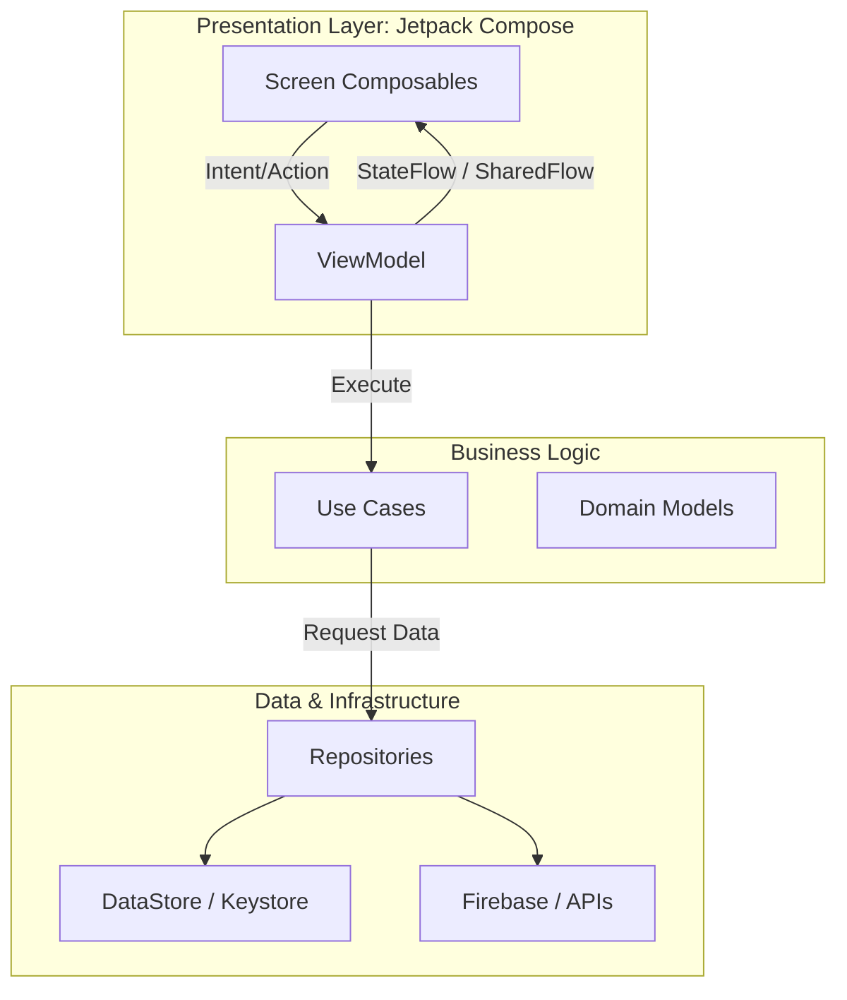
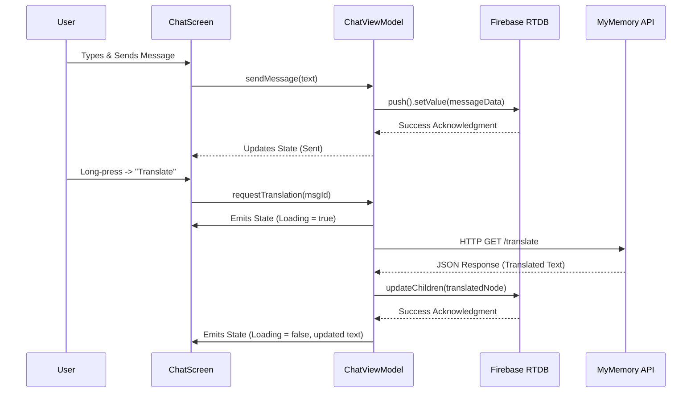
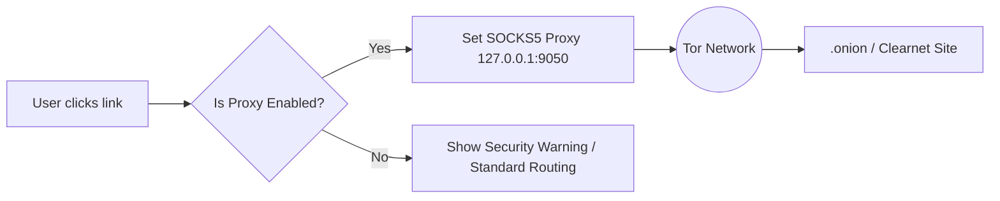

<p align="center">
  
</p>

<h1 align="center">Nexus Chat (Developer Template & Portfolio Edition)</h1>

<p align="center">
  <strong>The Ultimate Privacy-First, AI-Powered Messaging Platform Template for Android.</strong><br>
  Built with Jetpack Compose, Firebase, Clean Architecture, and Google Gemini AI.
</p>

<p align="center">
  
  
  
  
  
  
</p>

---

## 📖 Table of Contents
1. [Overview](#-overview)
2. [Core Features](#-core-features)
3. [Architecture & System Design](#-architecture--system-design)
4. [Security & Privacy Deep Dive](#-security--privacy-deep-dive)
5. [The AI Engine (Azel AI)](#-the-ai-engine-azel-ai)
6. [Project Structure](#-project-structure)
7. [Firebase Database Schema](#-firebase-database-schema)
8. [Installation & Setup](#-installation--setup)
9. [Tech Stack & Dependencies](#-tech-stack--dependencies)
10. [License](#-license)

---

## 🚀 Overview

**Nexus Chat** is a comprehensive, production-ready Android messaging template designed as a showcase of modern Android development. It goes far beyond a simple chat app by integrating high-end security paradigms, an integrated code environment, anonymous routing, and an advanced AI engine. 

This repository serves as a **developer portfolio piece and architectural template** for anyone looking to build highly scalable, secure, and feature-rich Android applications using the latest industry standards (Unidirectional Data Flow, Clean Architecture, Hilt, Coroutines).

---

## ✨ Core Features

### 💬 Next-Generation Messaging
*   **Real-Time Sync:** Powered by Firebase Realtime Database for instantaneous message delivery, typing indicators, and online presence.
*   **Media Caching:** Blazing fast image and media loading with **Coil 3**, ensuring smooth scrolling and optimal memory usage.
*   **In-Chat Translation:** Auto-translate messages on the fly without leaving the conversation using the MyMemory API.
*   **Ephemeral Stories:** Share photos and videos with friends via a custom built-in Story Viewer and Editor.

### 🛡️ Uncompromising Privacy
*   **Tor / Orbot Integration:** Route sensitive web traffic and access `.onion` hidden services directly inside the app using SOCKS5 proxy routing.
*   **AES-256-GCM Backups:** Export and restore entire chat histories in `.azelback` format. Keys are derived via PBKDF2 using user-defined passwords.
*   **App Lock:** Secure the app interface using Android's native `BiometricPrompt` (Fingerprint/Face) or a robust hashed PIN.
*   **True Media Deletion:** When a message with media is deleted, the app issues a physical deletion command to the Firebase Storage bucket to ensure no orphaned files remain.

### 🤖 Integrated AI (Azel AI / Gemini)
*   **Google Gemini SDK:** A smart conversational assistant capable of code analysis, summarization, and contextual assistance.
*   **Custom Prompt Engineering:** Features an advanced, multi-layered prompt engine supporting different operational modes.

### 💻 Developer & Hacker Tools
*   **Code Editor:** Built-in IDE (Sora Editor) supporting syntax highlighting for Python, JS, C, Bash, and Kotlin.
*   **Local Terminal Output:** Execute scripts and view standard output directly within the application sandbox.

### 📞 WebRTC Audio & Video Calls
*   **P2P Architecture:** Low-latency Peer-to-Peer calls leveraging WebRTC protocols.
*   **Call History:** Comprehensive call logs with duration tracking and detailed history filtering.

---

## 🏗️ Architecture & System Design

Nexus Chat strictly enforces **Clean Architecture** to guarantee modularity, testability, and scalability. It uses **Dagger Hilt** for dependency injection and **Kotlin Coroutines/Flow** for asynchronous data streams.

### 1. High-Level Architecture Flow



### 2. Message Translation Flow



---

## 🔒 Security & Privacy Deep Dive

### Encrypted Backups Pipeline (.azelback)
The application doesn't trust cloud backups blindly. Users can generate local backups that are cryptographically secure.

```mermaid
flowchart TD
    Init([User initiates Export]) --> Prompt[Prompt for Encryption Password]
    Prompt --> Fetch[Fetch JSON Chat Tree from Firebase]
    Fetch --> KDF[Key Derivation: PBKDF2(Password + Random Salt)]
    KDF --> Encrypt[Encrypt payload: AES-256-GCM]
    Encrypt --> Package[Package payload + IV + Salt into .azelback]
    Package --> Save([Write to Local Device Storage])
```

### Tor Network Routing
When Tor Mode is activated, internal web views and network clients are forced through a local SOCKS5 proxy provided by Orbot.



---

## 🧠 The AI Engine (Azel AI)

The app integrates Google's Generative AI. The AI engine is decoupled into its own domain package:
- `AIEngine.kt`: Core wrapper around the Gemini SDK handling streaming (`generateContentStream`).
- `UncensoredPrompts.kt`: Contains heavily researched and structured system prompts for advanced technical responses, cybersecurity research, and deep code analysis.
- **State Handling**: AI responses are parsed in real-time, handling API rate limits and providing visual typing feedback to the user via Compose `LazyColumn` item updates.

---

## 📁 Project Structure

The codebase is organized by feature and layer to ensure high maintainability.

```text
com.Azelmods.App
├── data/               # Data layer (Network, Local DB, Repositories)
│   ├── ai/             # Gemini API integration & Prompt engineering
│   ├── security/       # Encryption (SignalKeyStore, AES-GCM)
│   ├── tor/            # Orbot proxy integration logic
│   └── models/         # DTOs and Data Models
├── domain/             # Business Logic
│   └── usecases/       # Granular business rules
├── di/                 # Dependency Injection (Hilt Modules)
├── navigation/         # Compose Navigation Routes & Graphs
├── ui/                 # Presentation Layer
│   ├── components/     # Reusable Compose widgets (Buttons, TextFields, NavBars)
│   ├── screens/        # Full-screen Composables
│   │   ├── auth/       # Login / Registration
│   │   ├── chat/       # Messaging interface & bubbles
│   │   ├── settings/   # Preferences, Privacy, Appearance
│   │   ├── editor/     # Sora Code Editor interface
│   │   └── calls/      # WebRTC call screens
│   └── theme/          # Material 3 Color Schemes & Typography
├── utils/              # Extension functions & Helpers
└── webrtc/             # Audio/Video P2P signaling logic
```

---

## 🗄️ Firebase Database Schema

The Realtime Database is structured as a NoSQL JSON tree optimized for fast read/writes and querying.

```json
{
  "users": {
    "userId_1": {
      "uid": "userId_1",
      "name": "John Doe",
      "email": "john@example.com",
      "profileImageUrl": "https://...",
      "status": "online",
      "lastSeen": 1690000000
    }
  },
  "messages": {
    "conversationId_1": {
      "messageId_1": {
        "senderId": "userId_1",
        "text": "Hello World",
        "timestamp": 1690000000,
        "isTranslated": false
      }
    }
  },
  "stories": { ... },
  "calls": { ... }
}
```

---

## 🛠️ Installation & Setup

### Prerequisites
*   **IDE:** Android Studio Ladybug (or latest stable).
*   **SDK:** Minimum SDK 24, Target SDK 34+.
*   **Java:** JDK 17+.

### Step-by-Step Guide

1.  **Clone the Repository:**
    ```bash
    git clone https://github.com/Azelmods677/NexusChat.git
    cd NexusChat
    ```

2.  **Configure Firebase Backend:**
    *   Navigate to the [Firebase Console](https://console.firebase.google.com/).
    *   Create a new project and register an Android app (`com.Azelmods.App`).
    *   Download `google-services.json` and place it in the `app/` module directory.
    *   Enable **Email/Password Authentication**, **Realtime Database**, and **Storage**.

3.  **Configure API Keys:**
    *   Open `local.properties` in the root directory (create it if missing).
    *   Add your Google Gemini API Key:
        ```properties
        GEMINI_API_KEY=your_google_gemini_api_key_here
        ```

4.  **Build and Execute:**
    *   Sync the project with Gradle files in Android Studio.
    *   Select your physical device or emulator.
    *   Run the project (`Shift + F10`) or use the Gradle wrapper:
        ```bash
        ./gradlew assembleDebug
        ```

---

## 📚 Tech Stack & Dependencies

| Component | Technology | Description |
| :--- | :--- | :--- |
| **Language** | Kotlin | 100% Kotlin codebase |
| **UI Framework** | Jetpack Compose | Declarative UI, Material 3 Design System |
| **Architecture** | Clean + MVVM | Strict separation of concerns (UDF) |
| **Dependency Injection**| Dagger Hilt | Compile-time dependency graph |
| **Backend / DB** | Firebase | Auth, Realtime DB, Storage |
| **Image Loading** | Coil 3 | Coroutine-based image loading & caching |
| **Concurrency** | Kotlin Coroutines | Asynchronous, non-blocking programming |
| **Reactive Streams** | StateFlow / SharedFlow | Modern alternative to LiveData |
| **AI Processing** | Google Gemini SDK | Generative AI integration |
| **Local Storage** | Jetpack DataStore | Type-safe asynchronous preferences |
| **Cryptography** | `javax.crypto` | Native AES-256-GCM implementation |

---

## 📄 License

This software is distributed under the MIT License. See the [LICENSE](LICENSE) file for more information.

---
<p align="center">
  <i>Engineered with precision as a showcase of modern Android development.</i>
</p>
