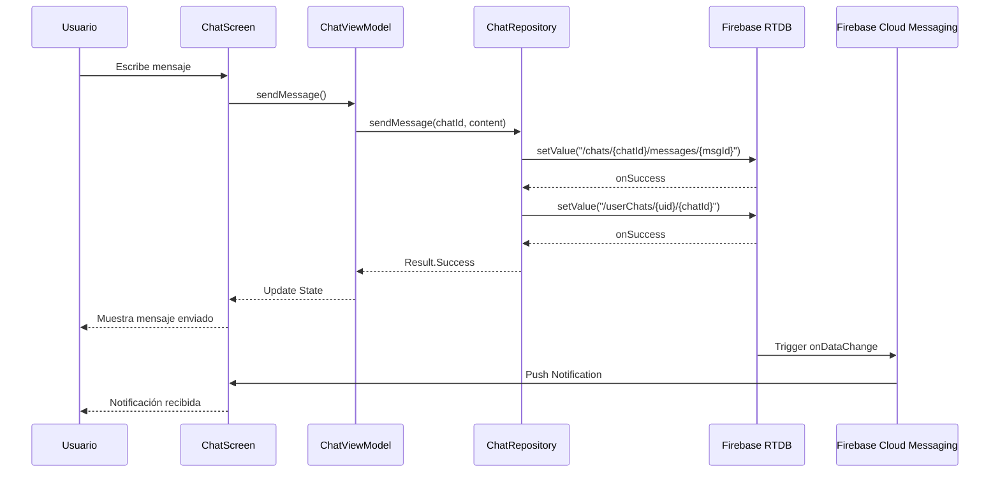
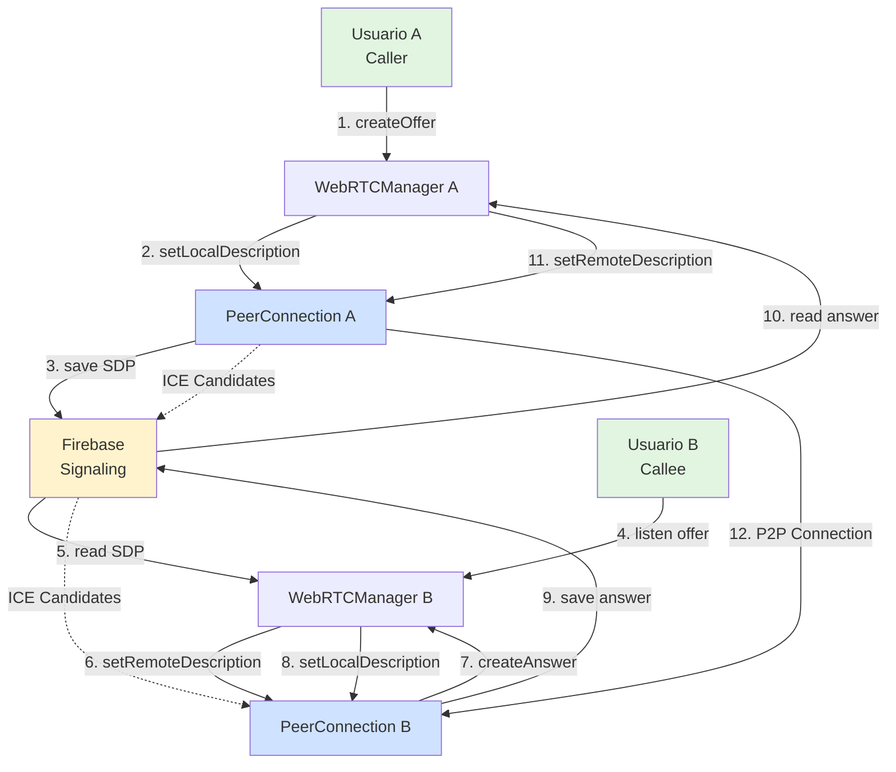
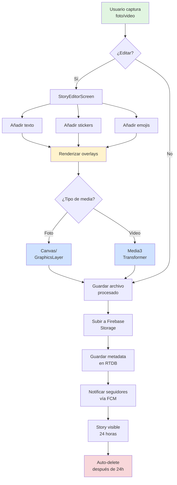
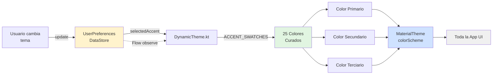
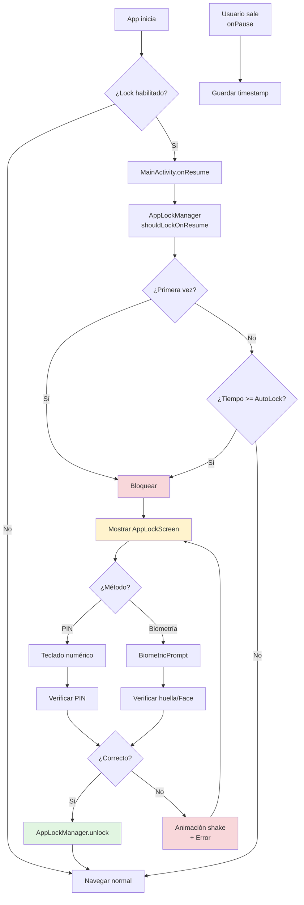
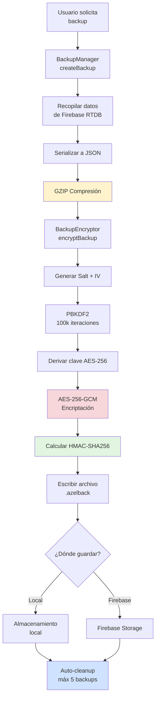

# 🚀 NexusChat - Enterprise Messaging Platform

<div align="center">


**Aplicación de mensajería premium para Android** construida con Kotlin, Jetpack Compose y Firebase. Integra características empresariales como llamadas WebRTC, Stories multimedia, navegación Tor, asistente IA con Gemini y seguridad de nivel militar.

[Características](#-características-principales) •
[Arquitectura](#-arquitectura) •
[Instalación](#-instalación-y-configuración) •
[Documentación](#-documentación-técnica) •
[Seguridad](#-seguridad)

</div>

---

## 📋 Tabla de Contenidos

- [Características Principales](#-características-principales)
- [Arquitectura](#-arquitectura)
- [Tecnologías](#-stack-tecnológico)
- [Instalación y Configuración](#-instalación-y-configuración)
- [Estructura del Proyecto](#-estructura-del-proyecto)
- [Características Técnicas Detalladas](#-características-técnicas-detalladas)
- [Sistema de Temas](#-sistema-de-temas-dinámicos)
- [Seguridad](#-seguridad)
- [Firebase y Backend](#-firebase-y-backend)
- [Diagramas de Arquitectura](#-diagramas-de-arquitectura)
- [Testing y Calidad](#-testing-y-calidad)
- [Contribución](#-contribución)
- [Licencia](#-licencia)

---

## ✨ Características Principales

### 💬 Mensajería Avanzada
- **Mensajería en tiempo real** con Firebase Realtime Database
- **Arquitectura optimizada** con índices y mapas para acceso O(1)
- **Multimedia completo**: imágenes, videos, audio, documentos, ubicación, contactos, stickers
- **Mensajes efímeros** con auto-destrucción configurable
- **Encriptación E2E** (en desarrollo)
- **Mensajes de voz** con visualización de forma de onda
- **Respuestas y reenvíos**
- **Indicadores de lectura** y estado en línea

### 📞 Llamadas y Videollamadas
- **WebRTC P2P** con señalización vía Firebase
- **Audio y video** de alta calidad
- **Servidor STUN** integrado
- **Notificaciones de llamada entrante** con FCM
- **Control de cámara y micrófono** en tiempo real
- **Cambio entre cámara frontal/trasera**
- **Mute y video off/on**

### 📸 Stories Multimedia
- **Editor avanzado** con overlays en tiempo real
- **Stickers y emojis arrastrables**
- **Texto personalizable** con fuentes y colores
- **Renderizado en archivo final** (Canvas para fotos, Media3 Transformer para videos)
- **Visualización temporal** (24 horas)
- **Indicadores de visualización**

### 🎨 Sistema de Temas Dinámicos
- **25 acentos de color** curados profesionalmente
- **Cambio en tiempo real** sin reiniciar
- **Material 3** con soporte completo
- **Modo oscuro optimizado**
- **Fondos de pantalla** personalizables (color sólido, gradiente, video)

### 🤖 Asistente de IA (AzelAI)
- **Integración con Gemini** (Google AI)
- **API Key del usuario** (almacenada cifrada)
- **Selección de modelos**: gemini-1.5-flash, gemini-1.5-pro, gemini-pro-vision
- **Streaming de respuestas** en tiempo real
- **Cola con backoff exponencial** y rate limiting
- **Gestión de contexto** inteligente
- **Respuestas profesionales** con prompt de sistema optimizado


### 🔒 Seguridad de Nivel Militar

#### 1. **Bloqueo de Aplicación** (App Lock) 🆕
- **PIN de 4-6 dígitos** con hash SHA-256
- **Autenticación biométrica** (huella digital / Face ID)
- **Auto-bloqueo configurable**: inmediato, 1, 5 o 30 minutos
- **Pantalla de bloqueo profesional** con animaciones
- **Teclado numérico personalizado**
- **Verificación automática** al completar PIN
- **Feedback visual de errores** con animación shake
- **Interceptor en lifecycle** para bloqueo consistente

#### 2. **Copias de Seguridad Cifradas**
- **AES-256-GCM** para encriptación autenticada
- **PBKDF2** (100,000 iteraciones) para derivación de claves
- **HMAC-SHA256** para verificación de integridad
- **Compresión GZIP** para optimizar tamaño
- **Almacenamiento dual**: Firebase Storage + local
- **Backups incrementales** con auto-limpieza
- **Formato de archivo propietario** con versioning

#### 3. **Navegador Tor (Orbot)**
- **Enrutado por Orbot** (HTTP 8118 + SOCKS5 9050 fallback)
- **Soporte para sitios .onion** (Dark Web)
- **Detección automática** de Orbot instalado
- **Estado visual** del proxy Tor
- **Navegación anónima** con DuckDuckGo
- **Guía de instalación** integrada

#### 4. **Mensajes Autodestructivos**
- **Temporizador configurable** (segundos a días)
- **Vista única** para multimedia sensible
- **Eliminación automática** de Firebase al expirar
- **Countdown visual** en tiempo real
- **Barra de progreso** indicadora

---


## 🏗️ Arquitectura

NexusChat sigue una arquitectura **MVVM (Model-View-ViewModel)** limpia y escalable, con inyección de dependencias vía **Hilt** y comunicación reactiva mediante **Kotlin Flow** y **StateFlow**.

### Capas de Arquitectura

```
┌─────────────────────────────────────────────────────────────────┐
│                          UI Layer (Compose)                      │
│  ┌────────────────────────────────────────────────────────────┐ │
│  │  Screens: Chat, Calls, Stories, Security, Settings, AI    │ │
│  │  Components: MessageBubble, AttachmentSheet, VideoPlayer  │ │
│  │  Theme: DynamicTheme (25 colores), Material 3             │ │
│  └────────────────────────────────────────────────────────────┘ │
└─────────────────────────────────────────────────────────────────┘
                              ↓↑
┌─────────────────────────────────────────────────────────────────┐
│                       ViewModel Layer                            │
│  ┌────────────────────────────────────────────────────────────┐ │
│  │  ChatViewModel, CallViewModel, StoryViewModel, etc.       │ │
│  │  State management con StateFlow/MutableStateFlow          │ │
│  │  Lógica de presentación y eventos UI                      │ │
│  └────────────────────────────────────────────────────────────┘ │
└─────────────────────────────────────────────────────────────────┘
                              ↓↑
┌─────────────────────────────────────────────────────────────────┐
│                      Repository Layer                            │
│  ┌────────────────────────────────────────────────────────────┐ │
│  │  RealtimeDatabaseRepository, ChatRepository, etc.         │ │
│  │  Abstracción de fuentes de datos                          │ │
│  │  Gestión de caché y sincronización                        │ │
│  └────────────────────────────────────────────────────────────┘ │
└─────────────────────────────────────────────────────────────────┘
                              ↓↑
┌─────────────────────────────────────────────────────────────────┐
│                       Data Sources                               │
│  ┌──────────────┬──────────────┬──────────────┬──────────────┐ │
│  │   Firebase   │   DataStore  │    WebRTC    │   Gemini AI  │ │
│  │   Realtime   │ Preferences  │    Manager   │     API      │ │
│  │   Database   │              │              │              │ │
│  └──────────────┴──────────────┴──────────────┴──────────────┘ │
└─────────────────────────────────────────────────────────────────┘
```

### Principios de Diseño
- **Single Responsibility**: Cada clase tiene una única responsabilidad
- **Dependency Inversion**: Las capas superiores no dependen de las inferiores
- **Interface Segregation**: Interfaces específicas y mínimas
- **Clean Architecture**: Separación clara de responsabilidades

---


## 🛠️ Stack Tecnológico

### Core
- **Kotlin** 2.1.0 - Lenguaje principal
- **Jetpack Compose** 2025.04.01 - UI moderna y declarativa
- **Material 3** - Design system
- **Coroutines** 1.9.0 - Programación asíncrona
- **Flow** - Streams reactivos

### Android Jetpack
- **Lifecycle** 2.8.7 - Gestión de ciclo de vida
- **Navigation-Compose** 2.8.5 - Navegación declarativa
- **DataStore** 1.1.1 - Almacenamiento de preferencias
- **WorkManager** 2.10.0 - Tareas en background
- **BiometricPrompt** 1.1.0 - Autenticación biométrica
- **Security-Crypto** 1.1.0-alpha07 - Encriptación de datos

### Inyección de Dependencias
- **Hilt** 2.52 - DI framework
- **Hilt Navigation Compose** 1.2.0 - Integración con navegación

### Firebase (BOM 33.7.0)
- **Firebase Auth** - Autenticación
- **Firebase Realtime Database** - Base de datos en tiempo real
- **Firebase Storage** - Almacenamiento de archivos
- **Firebase Cloud Messaging** - Notificaciones push
- **Firebase Crashlytics** - Monitoreo de errores

### WebRTC y Multimedia
- **WebRTC** (Google) - Llamadas P2P
- **Media3 ExoPlayer** 1.5.0 - Reproducción de video
- **Media3 Transformer** 1.5.0 - Composición de videos
- **Coil 3.x** - Carga de imágenes optimizada

### IA y APIs
- **Generative AI SDK** (Gemini) - Asistente de IA
- **Retrofit** 2.11.0 - Cliente HTTP
- **OkHttp** 4.12.0 - Cliente HTTP avanzado
- **Moshi** 1.15.1 - Serialización JSON

### Testing
- **JUnit 5** - Framework de testing
- **Mockk** 1.13.13 - Mocking para Kotlin
- **Turbine** 1.2.0 - Testing de Flows
- **Coroutines Test** - Testing de coroutines

### Build Tools
- **Gradle** 8.12 - Build system
- **KSP** 2.1.0-1.0.29 - Kotlin Symbol Processing
- **Android Gradle Plugin** 8.8.0

---


## 🚀 Instalación y Configuración

### Requisitos Previos
- **Android Studio** Ladybug (2024.2.1) o superior
- **JDK** 17 o superior
- **Gradle** 8.12+
- **Android SDK** 34+
- **Proyecto de Firebase** configurado

### 1. Clonar el Repositorio

```bash
git clone https://github.com/AzelMods677/NexusChat.git
cd NexusChat
```

### 2. Configurar Firebase

#### a) Crear Proyecto Firebase
1. Ve a [Firebase Console](https://console.firebase.google.com/)
2. Crea un nuevo proyecto
3. Añade una aplicación Android con el paquete: `com.Azelmods.App`

#### b) Descargar google-services.json
1. Descarga el archivo `google-services.json` de tu proyecto Firebase
2. Colócalo en `app/google-services.json`

#### c) Habilitar Servicios Firebase
En la consola de Firebase, habilita:
- ✅ **Authentication** (Email/Password y Google)
- ✅ **Realtime Database**
- ✅ **Storage**
- ✅ **Cloud Messaging**
- ✅ **Crashlytics** (opcional)

#### d) Configurar Reglas de Seguridad

**Realtime Database** (`database.rules.json`):
```json
{
  "rules": {
    "chats": {
      "$chatId": {
        ".read": "auth != null && (data.child('members').child(auth.uid).exists() || data.child('participants').child(auth.uid).exists())",
        ".write": "auth != null && (!data.exists() || data.child('members').child(auth.uid).exists() || data.child('participants').child(auth.uid).exists())"
      }
    },
    "userChats": {
      "$userId": {
        ".read": "auth != null && auth.uid == $userId",
        ".write": "auth != null && auth.uid == $userId"
      }
    }
  }
}
```

Despliega las reglas:
```bash
firebase deploy --only database
```


### 3. Configurar API Key de Gemini (IA)

La aplicación NO incluye ninguna API key embebida. Configúrala de una de estas formas:

#### Opción A: Desde la Aplicación (Recomendado)
1. Abre la app
2. Ve a **Ajustes** → **IA** → **API Key de Gemini**
3. Pega tu API key
4. Se guardará cifrada en el dispositivo

#### Opción B: Para Desarrollo
Crea o edita `local.properties` en la raíz del proyecto:
```properties
GEMINI_API_KEY=tu_api_key_aqui
```

Obtén tu API key en: [Google AI Studio](https://makersuite.google.com/app/apikey)

### 4. Compilar y Ejecutar

```bash
# Compilar Debug
./gradlew assembleDebug

# Instalar en dispositivo conectado
./gradlew installDebug

# Ejecutar tests
./gradlew test

# Generar APK Release
./gradlew assembleRelease
```

### 5. Configuración Adicional (Opcional)

#### Orbot (Navegación Tor)
1. Instala **Orbot** desde [Google Play](https://play.google.com/store/apps/details?id=org.torproject.android)
2. Abre Orbot y pulsa **Iniciar**
3. La app detectará automáticamente el proxy

#### Servidor TURN para WebRTC
Para mejorar la conectividad en llamadas (especialmente detrás de NATs estrictos):

1. Configura un servidor TURN (ej: [coturn](https://github.com/coturn/coturn))
2. Añade las credenciales en `WebRTCManager.kt`:

```kotlin
private fun getIceServers(): List<PeerConnection.IceServer> {
    return listOf(
        PeerConnection.IceServer.builder("stun:stun.l.google.com:19302").createIceServer(),
        PeerConnection.IceServer.builder("turn:tu-servidor.com:3478")
            .setUsername("usuario")
            .setPassword("contraseña")
            .createIceServer()
    )
}
```

---


## 📂 Estructura del Proyecto

```
NexusChat/
├── app/
│   ├── src/
│   │   ├── main/
│   │   │   ├── java/com/Azelmods/App/
│   │   │   │   ├── data/                      # Capa de datos
│   │   │   │   │   ├── ai/                    # IA (Gemini)
│   │   │   │   │   │   ├── AiKeyStore.kt
│   │   │   │   │   │   ├── GeminiContextManager.kt
│   │   │   │   │   │   ├── GeminiRateLimiter.kt
│   │   │   │   │   │   └── GeminiRequestQueue.kt
│   │   │   │   │   ├── api/                   # APIs externas
│   │   │   │   │   │   ├── AzelAIApiService.kt
│   │   │   │   │   │   └── GeminiApiService.kt
│   │   │   │   │   ├── backup/                # Copias de seguridad
│   │   │   │   │   │   ├── BackupEncryptor.kt  # AES-256-GCM
│   │   │   │   │   │   ├── BackupManager.kt
│   │   │   │   │   │   └── BackupStorage.kt    # Firebase + Local
│   │   │   │   │   ├── manager/               # Gestores
│   │   │   │   │   │   ├── AppBackgroundManager.kt
│   │   │   │   │   │   └── DemoAccountManager.kt
│   │   │   │   │   ├── model/                 # Modelos de datos
│   │   │   │   │   │   ├── Chat.kt
│   │   │   │   │   │   ├── Message.kt
│   │   │   │   │   │   ├── Story.kt
│   │   │   │   │   │   ├── User.kt
│   │   │   │   │   │   └── Call.kt
│   │   │   │   │   ├── preferences/           # Almacenamiento local
│   │   │   │   │   │   ├── AppLockPreferences.kt
│   │   │   │   │   │   ├── TutorialPreferences.kt
│   │   │   │   │   │   └── UserPreferences.kt
│   │   │   │   │   ├── repository/            # Repositorios
│   │   │   │   │   │   ├── ChatRepository.kt
│   │   │   │   │   │   ├── RealtimeDatabaseRepository.kt
│   │   │   │   │   │   ├── StoryRepository.kt
│   │   │   │   │   │   └── UserRepository.kt
│   │   │   │   │   ├── security/              # Seguridad
│   │   │   │   │   │   ├── AppLockManager.kt  # 🆕 Bloqueo de app
│   │   │   │   │   │   └── tor/
│   │   │   │   │   │       ├── OrbotDetector.kt
│   │   │   │   │   │       ├── OrbotStatus.kt
│   │   │   │   │   │       └── OrbotStatusMapper.kt
│   │   │   │   │   └── session/               # Sesiones
│   │   │   │   │       └── SessionManager.kt
│   │   │   │   ├── di/                        # Dependency Injection
│   │   │   │   │   ├── AppModule.kt
│   │   │   │   │   ├── DatabaseModule.kt
│   │   │   │   │   ├── NetworkModule.kt
│   │   │   │   │   └── RepositoryModule.kt
│   │   │   │   ├── service/                   # Servicios Android
│   │   │   │   │   ├── CallService.kt
│   │   │   │   │   ├── NexusFirebaseMessagingService.kt
│   │   │   │   │   ├── CallNotificationReceiver.kt
│   │   │   │   │   └── MessageNotificationReceiver.kt
│   │   │   │   ├── ui/                        # UI (Jetpack Compose)
│   │   │   │   │   ├── components/            # Componentes reutilizables
│   │   │   │   │   │   ├── MessageBubble.kt
│   │   │   │   │   │   ├── AttachmentBottomSheet.kt
│   │   │   │   │   │   ├── VideoPlayer.kt
│   │   │   │   │   │   ├── DraggableEmoji.kt
│   │   │   │   │   │   └── AutoTutorial.kt
│   │   │   │   │   ├── navigation/            # Navegación
│   │   │   │   │   │   ├── NavGraph.kt
│   │   │   │   │   │   └── Screen.kt
│   │   │   │   │   ├── screens/               # Pantallas principales
│   │   │   │   │   │   ├── auth/              # Autenticación
│   │   │   │   │   │   │   ├── LoginScreen.kt
│   │   │   │   │   │   │   └── SignupScreen.kt
│   │   │   │   │   │   ├── azelai/            # Asistente IA
│   │   │   │   │   │   │   ├── AzelAIScreen.kt
│   │   │   │   │   │   │   ├── AzelAIViewModel.kt
│   │   │   │   │   │   │   └── AzelAIErrorMapper.kt
│   │   │   │   │   │   ├── call/              # Llamadas
│   │   │   │   │   │   │   ├── AudioCallScreen.kt
│   │   │   │   │   │   │   ├── VideoCallScreen.kt
│   │   │   │   │   │   │   └── IncomingCallScreen.kt
│   │   │   │   │   │   ├── chat/              # Chat
│   │   │   │   │   │   │   ├── ChatListScreen.kt
│   │   │   │   │   │   │   ├── ChatScreen.kt
│   │   │   │   │   │   │   └── ChatViewModel.kt
│   │   │   │   │   │   ├── profile/           # Perfiles
│   │   │   │   │   │   │   ├── ProfileScreen.kt
│   │   │   │   │   │   │   └── ProfileViewerScreen.kt
│   │   │   │   │   │   ├── security/          # Seguridad
│   │   │   │   │   │   │   ├── AppLockScreen.kt     # 🆕 Pantalla de bloqueo
│   │   │   │   │   │   │   ├── SecurityScreen.kt
│   │   │   │   │   │   │   ├── TorBrowserScreenNew.kt
│   │   │   │   │   │   │   └── TorControlScreen.kt
│   │   │   │   │   │   ├── settings/          # Ajustes
│   │   │   │   │   │   │   ├── SettingsScreen.kt
│   │   │   │   │   │   │   ├── HelpSupportScreen.kt
│   │   │   │   │   │   │   └── PrivacyScreen.kt
│   │   │   │   │   │   └── story/             # Stories
│   │   │   │   │   │       ├── StoryScreen.kt
│   │   │   │   │   │       ├── StoryEditorScreen.kt
│   │   │   │   │   │       └── StoryViewerScreen.kt
│   │   │   │   │   └── theme/                 # Tema y estilos
│   │   │   │   │       ├── Color.kt
│   │   │   │   │       ├── DynamicTheme.kt    # 25 colores
│   │   │   │   │       ├── Theme.kt
│   │   │   │   │       └── Type.kt
│   │   │   │   ├── utils/                     # Utilidades
│   │   │   │   │   ├── StoryVideoComposer.kt
│   │   │   │   │   ├── DateUtils.kt
│   │   │   │   │   └── PermissionUtils.kt
│   │   │   │   ├── webrtc/                    # WebRTC
│   │   │   │   │   └── WebRTCManager.kt
│   │   │   │   ├── MainActivity.kt            # Activity principal
│   │   │   │   └── NexusChatApplication.kt    # Application class
│   │   │   ├── AndroidManifest.xml
│   │   │   └── res/                           # Recursos
│   │   └── androidTest/                       # Tests instrumentados
│   └── build.gradle.kts
├── functions/                                  # Cloud Functions
│   ├── index.js
│   └── package.json
├── database.rules.json                         # Reglas Firebase
├── CHANGELOG.md                                # Historial de cambios
├── CONTRIBUTING.md                             # Guía de contribución
├── LICENSE                                     # Licencia
├── README.md                                   # Este archivo
├── SECURITY.md                                 # Políticas de seguridad
├── build.gradle.kts                            # Build principal
└── settings.gradle.kts                         # Configuración Gradle
```

---


## 📊 Diagramas de Arquitectura

### 1. Diagrama de Flujo de Mensajería



### 2. Diagrama de Arquitectura WebRTC




### 3. Diagrama de Flujo de Stories



### 4. Diagrama de Sistema de Temas




### 5. Diagrama de Seguridad - App Lock



### 6. Diagrama de Copias de Seguridad Cifradas



---


## 🔧 Características Técnicas Detalladas

### Firebase Realtime Database - Arquitectura Optimizada

#### Estructura de Datos con Mapas e Índices

La base de datos utiliza una arquitectura optimizada con **mapas** en lugar de arrays para membresía de chats y un **índice `userChats`** para acceso O(1):

```javascript
{
  "chats": {
    "chatId123": {
      "members": {                    // ✅ Map en lugar de array
        "uid1": true,
        "uid2": true
      },
      "participants": {               // ✅ Map en lugar de array
        "uid1": true,
        "uid2": true
      },
      "messages": {
        "msgId1": { /* ... */ }
      },
      "lastMessage": "Hola mundo",
      "lastMessageTimestamp": 1234567890,
      "createdBy": "uid1",
      "createdAt": 1234567890
    }
  },
  "userChats": {                      // ✅ Índice para acceso O(1)
    "uid1": {
      "chatId123": true,
      "chatId456": true
    }
  },
  "users": {
    "uid1": {
      "displayName": "Juan Pérez",
      "email": "juan@example.com",
      "photoUrl": "https://...",
      "status": "online",
      "lastSeen": 1234567890
    }
  }
}
```

#### Ventajas de esta Arquitectura

1. **Validación eficiente**: `.child(auth.uid).exists()` es O(1) vs O(n) con arrays
2. **Acceso directo a chats**: `userChats/{uid}` lista los chats sin escanear toda la DB
3. **Escalabilidad**: Rendimiento constante independientemente del número de miembros
4. **Reglas de seguridad simples**: Verificación directa de membresía


### WebRTC - Llamadas P2P

#### Flujo de Conexión

1. **Caller** crea una oferta (SDP) y la guarda en Firebase
2. **Callee** escucha la oferta y crea una respuesta (SDP)
3. Intercambio de **ICE candidates** vía Firebase
4. Establecimiento de conexión P2P directa

#### Configuración de Servidores ICE

```kotlin
private fun getIceServers(): List<PeerConnection.IceServer> {
    return listOf(
        // STUN server gratuito de Google
        PeerConnection.IceServer.builder("stun:stun.l.google.com:19302")
            .createIceServer(),
        
        // TURN server (opcional, para NATs estrictos)
        // PeerConnection.IceServer.builder("turn:tu-servidor.com:3478")
        //     .setUsername("usuario")
        //     .setPassword("contraseña")
        //     .createIceServer()
    )
}
```

#### Características WebRTC Implementadas

- ✅ Audio y video simultáneos
- ✅ Cambio de cámara (frontal/trasera)
- ✅ Mute de audio
- ✅ Desactivar/activar video
- ✅ Manejo de permisos de cámara y micrófono
- ✅ Notificaciones de llamada entrante
- ✅ Conexión automática al contestar
- ✅ Desconexión limpia

---


## 🎨 Sistema de Temas Dinámicos

### 25 Colores de Acento Curados

La aplicación incluye una paleta cuidadosamente seleccionada de 25 colores que se aplican en tiempo real a toda la interfaz:

```kotlin
// DynamicTheme.kt
object AppTheme {
    val ACCENT_SWATCHES = listOf(
        // Colores primarios
        Pair("Material You", Color(0xFF6750A4)),      // Morado Material
        Pair("Ocean Blue", Color(0xFF0277BD)),        // Azul océano
        Pair("Forest Green", Color(0xFF2E7D32)),      // Verde bosque
        Pair("Sunset Orange", Color(0xFFE65100)),     // Naranja atardecer
        Pair("Ruby Red", Color(0xFFC62828)),          // Rojo rubí
        
        // Colores pasteles
        Pair("Lavender", Color(0xFF9575CD)),          // Lavanda
        Pair("Mint", Color(0xFF4DB6AC)),              // Menta
        Pair("Peach", Color(0xFFFF8A65)),             // Durazno
        Pair("Sky", Color(0xFF4FC3F7)),               // Cielo
        Pair("Rose", Color(0xFFF06292)),              // Rosa
        
        // Colores vibrantes
        Pair("Electric Purple", Color(0xFF7C4DFF)),   // Púrpura eléctrico
        Pair("Neon Green", Color(0xFF00E676)),        // Verde neón
        Pair("Hot Pink", Color(0xFFFF4081)),          // Rosa fuerte
        Pair("Cyan", Color(0xFF00BCD4)),              // Cian
        Pair("Amber", Color(0xFFFFC107)),             // Ámbar
        
        // Colores oscuros
        Pair("Midnight Blue", Color(0xFF1A237E)),     // Azul medianoche
        Pair("Deep Purple", Color(0xFF4A148C)),       // Púrpura profundo
        Pair("Dark Teal", Color(0xFF004D40)),         // Verde azulado oscuro
        Pair("Burgundy", Color(0xFF880E4F)),          // Borgoña
        Pair("Chocolate", Color(0xFF4E342E)),         // Chocolate
        
        // Colores naturales
        Pair("Olive", Color(0xFF827717)),             // Oliva
        Pair("Coral", Color(0xFFFF7043)),             // Coral
        Pair("Turquoise", Color(0xFF26C6DA)),         // Turquesa
        Pair("Gold", Color(0xFFFFD600)),              // Oro
        Pair("Slate", Color(0xFF546E7A))              // Pizarra
    )
}
```

### Aplicación en Tiempo Real

El tema se aplica a través de `MaterialTheme.colorScheme`, lo que significa que **todos los componentes Material 3** respetan automáticamente el color seleccionado:

```kotlin
@Composable
fun NexusChatTheme(
    userPreferences: UserPreferences,
    content: @Composable () -> Unit
) {
    val selectedAccent by userPreferences.themeAccent.collectAsState(initial = 0)
    val accentColor = AppTheme.ACCENT_SWATCHES[selectedAccent].second
    
    val colorScheme = darkColorScheme(
        primary = accentColor,
        secondary = accentColor.copy(alpha = 0.7f),
        tertiary = accentColor.copy(alpha = 0.5f),
        // ... demás colores derivados
    )
    
    MaterialTheme(
        colorScheme = colorScheme,
        typography = Typography,
        content = content
    )
}
```

### Cambio de Tema

El usuario puede cambiar el tema en **Ajustes → Apariencia → Color de acento**, y el cambio se aplica **instantáneamente** sin reiniciar la aplicación gracias a la observación reactiva con Flow.

---


## 🔐 Seguridad

### 1. App Lock - Bloqueo de Aplicación

Sistema completo de bloqueo con PIN y biometría:

#### Características
- **PIN de 4-6 dígitos** hasheado con SHA-256
- **Autenticación biométrica** (huella digital / Face ID)
- **Auto-bloqueo configurable**: 0 (inmediato), 1, 5, 30 minutos
- **Interceptor en lifecycle** (onResume/onPause)
- **UI profesional** con animaciones
- **Verificación automática** al completar PIN

#### Flujo de Bloqueo

```kotlin
// MainActivity verifica en cada onResume
override fun onResume() {
    super.onResume()
    lifecycleScope.launch {
        if (appLockManager.shouldLockOnResume()) {
            appLockManager.lock()  // Activa el bloqueo
        }
    }
}

// Se muestra AppLockScreen hasta que el usuario se autentique
if (showLockScreen.value) {
    AppLockScreen(
        onUnlocked = {
            showLockScreen.value = false
            appLockManager.unlock()
        }
    )
}
```

#### Configuración

```kotlin
// AppLockPreferences usa DataStore con encriptación
class AppLockPreferences(context: Context) {
    private val dataStore: DataStore<Preferences> = context.dataStore
    
    suspend fun setPin(pin: String) {
        dataStore.edit { prefs ->
            prefs[KEY_PIN_HASH] = hashPin(pin)  // SHA-256
        }
    }
    
    suspend fun verifyPin(pin: String): Boolean {
        val stored = dataStore.data.first()[KEY_PIN_HASH] ?: return false
        return stored == hashPin(pin)
    }
}
```

---

### 2. Copias de Seguridad Cifradas

Sistema robusto de backups con encriptación militar:

#### Características de Seguridad
- **AES-256-GCM**: Encriptación autenticada
- **PBKDF2** con 100,000 iteraciones para derivar claves
- **HMAC-SHA256** para verificación de integridad
- **Salt y IV únicos** por cada backup
- **Compresión GZIP** antes de encriptar

#### Formato de Archivo (.azelback)

```
[MAGIC_BYTES: 8 bytes]   "AZELBACK"
[VERSION: 1 byte]         0x01
[SALT: 32 bytes]          Random
[IV: 12 bytes]            Random
[HMAC: 32 bytes]          SHA-256
[ENCRYPTED_DATA: var]     AES-256-GCM
```

#### Proceso de Encriptación

```kotlin
fun encryptBackup(inputFile: File, outputFile: File, password: String): Boolean {
    // 1. Generar salt y IV aleatorios
    val salt = ByteArray(32).apply { SecureRandom().nextBytes(this) }
    val iv = ByteArray(12).apply { SecureRandom().nextBytes(this) }
    
    // 2. Derivar clave de 256 bits con PBKDF2
    val key = deriveKey(password, salt)
    
    // 3. Comprimir datos con GZIP
    val compressed = compress(inputFile.readBytes())
    
    // 4. Encriptar con AES-256-GCM
    val encrypted = encrypt(compressed, key, iv)
    
    // 5. Calcular HMAC para integridad
    val hmac = calculateHMAC(encrypted, key)
    
    // 6. Escribir archivo con header
    writeBackupFile(outputFile, salt, iv, hmac, encrypted)
}
```

#### Almacenamiento Dual

Los backups se pueden guardar en:
- **Local**: `getExternalFilesDir("backups")` o `filesDir/backups`
- **Firebase Storage**: `backups/{uid}/{timestamp}_backup.azelback`

Con auto-limpieza que mantiene máximo 5 backups por ubicación.

---


### 3. Navegador Tor con Orbot

Soporte completo para navegación anónima a través de Tor:

#### Características
- **Detección automática** de Orbot instalado
- **Dual proxy support**: HTTP (8118) + SOCKS5 (9050) fallback
- **Soporte .onion** para sitios de la Dark Web
- **Estado visual** del proxy Tor
- **Integración con DuckDuckGo**

#### Implementación

```kotlin
// OrbotDetector verifica instalación y estado
object OrbotDetector {
    fun isOrbotInstalled(context: Context): Boolean {
        return try {
            context.packageManager.getPackageInfo("org.torproject.android", 0)
            true
        } catch (e: PackageManager.NameNotFoundException) {
            // Intenta con paquete alternativo
            try {
                context.packageManager.getPackageInfo("org.torproject.orbot", 0)
                true
            } catch (e: PackageManager.NameNotFoundException) {
                false
            }
        }
    }
    
    fun isTorAvailable(): Boolean {
        return try {
            // Verifica proxy HTTP
            val socket = Socket()
            socket.connect(InetSocketAddress("127.0.0.1", 8118), 1000)
            socket.close()
            true
        } catch (e: IOException) {
            // Intenta SOCKS5
            try {
                val socket = Socket()
                socket.connect(InetSocketAddress("127.0.0.1", 9050), 1000)
                socket.close()
                true
            } catch (e: IOException) {
                false
            }
        }
    }
}

// TorBrowserScreen configura proxy en WebView
webView.settings.apply {
    // Configura proxy HTTP para Orbot
    if (OrbotDetector.isTorAvailable()) {
        System.setProperty("http.proxyHost", "127.0.0.1")
        System.setProperty("http.proxyPort", "8118")
        System.setProperty("https.proxyHost", "127.0.0.1")
        System.setProperty("https.proxyPort", "8118")
    }
}

// Permitir sitios .onion solo cuando Tor está activo
override fun shouldOverrideUrlLoading(view: WebView?, request: WebResourceRequest?): Boolean {
    val url = request?.url?.toString() ?: return false
    return if (url.contains(".onion")) {
        if (OrbotDetector.isTorAvailable()) {
            view?.loadUrl(url)
            true
        } else {
            // Mostrar mensaje de que Orbot no está activo
            false
        }
    } else {
        view?.loadUrl(url)
        true
    }
}
```

---

### 4. Mensajes Autodestructivos

Los mensajes se eliminan automáticamente de Firebase al expirar:

#### Características
- **Temporizadores configurables**: desde segundos hasta días
- **Vista única** para multimedia sensible
- **Eliminación automática** en segundo plano
- **Countdown visual** en tiempo real

#### Implementación

```kotlin
// Model
data class Message(
    val messageId: String = "",
    val isEphemeral: Boolean = false,
    val isViewOnce: Boolean = false,
    val selfDestructDuration: Long = 0,  // segundos
    val selfDestructAt: Long = 0,         // timestamp
    val viewedBy: List<String> = emptyList()
)

// Cleanup automático en RealtimeDatabaseRepository
fun cleanupExpiredMessages(chatId: String) {
    val now = System.currentTimeMillis()
    messagesRef.child(chatId).get().addOnSuccessListener { snapshot ->
        snapshot.children.forEach { msg ->
            val destructAt = msg.child("selfDestructAt").getValue(Long::class.java) ?: 0L
            if (destructAt > 0 && now > destructAt) {
                msg.ref.removeValue()  // Elimina de Firebase
            }
        }
    }
}

// UI con countdown visual
@Composable
fun MessageBubble(message: Message) {
    var remainingSeconds by remember {
        mutableStateOf(calculateRemainingSeconds(message.selfDestructAt))
    }
    
    LaunchedEffect(message.selfDestructAt) {
        if (message.isEphemeral && message.selfDestructAt > 0) {
            while (remainingSeconds > 0) {
                delay(1000)
                remainingSeconds = calculateRemainingSeconds(message.selfDestructAt)
            }
        }
    }
    
    if (remainingSeconds > 0) {
        LinearProgressIndicator(
            progress = remainingSeconds.toFloat() / message.selfDestructDuration.toFloat()
        )
        Text("🕐 ${remainingSeconds}s")
    }
}
```

---


## 🤖 Asistente de IA (AzelAI)

### Integración con Gemini

El asistente usa la **API key del usuario**, almacenada de forma segura:

#### Gestión de API Key

```kotlin
// AiKeyStore - Almacenamiento cifrado con EncryptedSharedPreferences
class AiKeyStore(context: Context) {
    private val masterKey = MasterKey.Builder(context)
        .setKeyScheme(MasterKey.KeyScheme.AES256_GCM)
        .build()
    
    private val encryptedPrefs = EncryptedSharedPreferences.create(
        context,
        "azel_ai_secure_prefs",
        masterKey,
        EncryptedSharedPreferences.PrefKeyEncryptionScheme.AES256_SIV,
        EncryptedSharedPreferences.PrefValueEncryptionScheme.AES256_GCM
    )
    
    fun saveApiKey(apiKey: String) {
        encryptedPrefs.edit().putString(KEY_GEMINI_API, apiKey).apply()
    }
    
    fun getApiKey(): String? {
        return encryptedPrefs.getString(KEY_GEMINI_API, null)
            ?: BuildConfig.GEMINI_API_KEY.takeIf { it.isNotBlank() }
    }
}
```

#### Selección de Modelos

```kotlin
enum class GeminiModel(val modelId: String, val displayName: String) {
    FLASH("gemini-1.5-flash", "Gemini 1.5 Flash (Rápido)"),
    PRO("gemini-1.5-pro", "Gemini 1.5 Pro (Avanzado)"),
    PRO_VISION("gemini-pro-vision", "Gemini Pro Vision (Imágenes)")
}
```

#### Cola con Rate Limiting

```kotlin
// GeminiRequestQueue - Gestión de peticiones con backoff
class GeminiRequestQueue @Inject constructor(
    private val rateLimiter: GeminiRateLimiter
) {
    private val requestQueue = mutableListOf<PendingRequest>()
    private var isProcessing = false
    
    suspend fun enqueue(request: GeminiRequest): Flow<GeminiResponse> = flow {
        if (!rateLimiter.canMakeRequest()) {
            emit(GeminiResponse.Error("Rate limit exceeded. Try again later."))
            return@flow
        }
        
        rateLimiter.recordRequest()
        
        try {
            val response = executeRequest(request)
            emit(response)
        } catch (e: Exception) {
            val backoffDelay = calculateBackoff(request.retryCount)
            delay(backoffDelay)
            
            if (request.retryCount < MAX_RETRIES) {
                enqueue(request.copy(retryCount = request.retryCount + 1))
            } else {
                emit(GeminiResponse.Error("Max retries exceeded"))
            }
        }
    }
    
    private fun calculateBackoff(retryCount: Int): Long {
        return (INITIAL_BACKOFF * (2.0.pow(retryCount))).toLong()
    }
}

// GeminiRateLimiter - Free tier: 15 RPM, 1 RPD
class GeminiRateLimiter {
    private val requestTimestamps = mutableListOf<Long>()
    
    fun canMakeRequest(): Boolean {
        val now = System.currentTimeMillis()
        
        // Limpiar timestamps antiguos (>1 minuto)
        requestTimestamps.removeAll { now - it > 60_000 }
        
        // Verificar límite de 15 por minuto
        return requestTimestamps.size < 15
    }
}
```

#### Streaming de Respuestas

```kotlin
@Composable
fun AzelAIScreen(viewModel: AzelAIViewModel = hiltViewModel()) {
    val messages by viewModel.messages.collectAsState()
    val isStreaming by viewModel.isStreaming.collectAsState()
    
    LaunchedEffect(Unit) {
        viewModel.streamingResponse.collect { chunk ->
            // Actualiza mensaje en tiempo real
            viewModel.appendToLastMessage(chunk)
        }
    }
    
    // UI muestra respuestas en tiempo real
    LazyColumn {
        items(messages) { message ->
            MessageBubble(message)
        }
        
        if (isStreaming) {
            item {
                TypingIndicator()
            }
        }
    }
}
```

---


## 📸 Stories - Editor Multimedia

### Renderización de Overlays

El sistema de Stories renderiza overlays (texto, stickers, emojis) directamente en el archivo final:

#### Para Fotos (Canvas/GraphicsLayer)

```kotlin
@Composable
fun renderStoryPhoto(
    baseImage: Bitmap,
    overlays: List<StoryOverlay>
): Bitmap {
    return AndroidView(
        factory = { context ->
            ImageView(context).apply {
                setImageBitmap(baseImage)
            }
        },
        modifier = Modifier
            .graphicsLayer {
                // Captura toda la UI incluyendo overlays
                compositingStrategy = CompositingStrategy.Offscreen
                renderEffect = null
            }
            .drawWithContent {
                drawContent()
                
                // Dibuja overlays
                overlays.forEach { overlay ->
                    when (overlay) {
                        is TextOverlay -> drawText(overlay)
                        is StickerOverlay -> drawSticker(overlay)
                        is EmojiOverlay -> drawEmoji(overlay)
                    }
                }
            }
    ).toBitmap()
}
```

#### Para Videos (Media3 Transformer)

```kotlin
// StoryVideoComposer - Composición con Media3 Transformer
class StoryVideoComposer @Inject constructor(
    private val context: Context
) {
    fun composeVideo(
        videoUri: Uri,
        overlays: List<StoryOverlay>,
        outputFile: File
    ): Flow<CompositionProgress> = flow {
        val transformer = Transformer.Builder(context)
            .addListener(object : Transformer.Listener {
                override fun onTransformationCompleted(
                    composition: MediaItem,
                    result: ExportResult
                ) {
                    emit(CompositionProgress.Complete(outputFile))
                }
                
                override fun onTransformationError(
                    composition: MediaItem,
                    result: ExportResult,
                    exception: ExportException
                ) {
                    emit(CompositionProgress.Error(exception))
                }
            })
            .setVideoEffects(listOf(
                OverlayEffect(overlays)  // Custom effect
            ))
            .build()
        
        transformer.startTransformation(
            MediaItem.fromUri(videoUri),
            outputFile.absolutePath
        )
    }
    
    // Custom effect para dibujar overlays
    class OverlayEffect(
        private val overlays: List<StoryOverlay>
    ) : GlEffect {
        override fun toGlShaderProgram(
            context: Context,
            useHdr: Boolean
        ): GlShaderProgram {
            return object : BaseGlShaderProgram(useHdr) {
                override fun drawFrame(
                    inputTexId: Int,
                    presentationTimeUs: Long
                ) {
                    // Dibuja video base
                    super.drawFrame(inputTexId, presentationTimeUs)
                    
                    // Dibuja overlays en cada frame
                    overlays.forEach { overlay ->
                        drawOverlay(overlay, presentationTimeUs)
                    }
                }
            }
        }
    }
}
```

### Tipos de Overlays

```kotlin
sealed class StoryOverlay {
    abstract val id: String
    abstract val position: Offset
    abstract val rotation: Float
    abstract val scale: Float
    
    data class TextOverlay(
        override val id: String,
        override val position: Offset,
        override val rotation: Float,
        override val scale: Float,
        val text: String,
        val fontSize: Float,
        val color: Color,
        val fontFamily: FontFamily,
        val textAlign: TextAlign
    ) : StoryOverlay()
    
    data class StickerOverlay(
        override val id: String,
        override val position: Offset,
        override val rotation: Float,
        override val scale: Float,
        val stickerRes: Int
    ) : StoryOverlay()
    
    data class EmojiOverlay(
        override val id: String,
        override val position: Offset,
        override val rotation: Float,
        override val scale: Float,
        val emoji: String
    ) : StoryOverlay()
}
```

---


## 🧪 Testing y Calidad

### Estructura de Tests

```
app/src/
├── test/                              # Tests unitarios
│   ├── java/com/Azelmods/App/
│   │   ├── data/
│   │   │   ├── repository/
│   │   │   │   ├── ChatRepositoryTest.kt
│   │   │   │   └── UserRepositoryTest.kt
│   │   │   └── security/
│   │   │       ├── AppLockManagerTest.kt
│   │   │       └── BackupEncryptorTest.kt
│   │   └── ui/
│   │       └── viewmodel/
│   │           ├── ChatViewModelTest.kt
│   │           └── AzelAIViewModelTest.kt
│
└── androidTest/                       # Tests instrumentados
    └── java/com/Azelmods/App/
        ├── data/
        │   └── security/
        │       └── tor/
        │           └── OrbotDetectorTest.kt
        └── ui/
            └── screens/
                └── chat/
                    └── ChatScreenTest.kt
```

### Ejemplo de Test Unitario

```kotlin
@ExperimentalCoroutinesTest
class ChatViewModelTest {
    
    @get:Rule
    val instantTaskExecutorRule = InstantTaskExecutorRule()
    
    private lateinit var viewModel: ChatViewModel
    private val chatRepository: ChatRepository = mockk()
    private val testDispatcher = UnconfinedTestDispatcher()
    
    @Before
    fun setup() {
        Dispatchers.setMain(testDispatcher)
        viewModel = ChatViewModel(chatRepository)
    }
    
    @After
    fun tearDown() {
        Dispatchers.resetMain()
    }
    
    @Test
    fun `sendMessage should update messages state`() = runTest {
        // Given
        val chatId = "chat123"
        val message = "Test message"
        coEvery { 
            chatRepository.sendMessage(chatId, message) 
        } returns Result.Success(Unit)
        
        // When
        viewModel.sendMessage(chatId, message)
        
        // Then
        val state = viewModel.uiState.value
        assertTrue(state.messages.any { it.content == message })
        coVerify { chatRepository.sendMessage(chatId, message) }
    }
    
    @Test
    fun `loadMessages should emit loading and success states`() = runTest {
        // Given
        val chatId = "chat123"
        val messages = listOf(
            Message(messageId = "1", content = "Hello"),
            Message(messageId = "2", content = "World")
        )
        coEvery { chatRepository.getMessages(chatId) } returns flowOf(messages)
        
        // When
        viewModel.loadMessages(chatId)
        
        // Then
        viewModel.uiState.test {
            assertEquals(UiState.Loading, awaitItem())
            val successState = awaitItem() as UiState.Success
            assertEquals(messages, successState.data)
        }
    }
}
```

### Tests de Seguridad

```kotlin
class BackupEncryptorTest {
    
    private lateinit var encryptor: BackupEncryptor
    private lateinit var testFile: File
    
    @Before
    fun setup() {
        encryptor = BackupEncryptor()
        testFile = File.createTempFile("test", ".txt")
        testFile.writeText("Sensitive data to encrypt")
    }
    
    @Test
    fun `encryption and decryption should preserve data`() {
        // Given
        val password = "strong_password_123"
        val encryptedFile = File.createTempFile("encrypted", ".azelback")
        val decryptedFile = File.createTempFile("decrypted", ".txt")
        
        // When
        val encrypted = encryptor.encryptBackup(testFile, encryptedFile, password)
        val decrypted = encryptor.decryptBackup(encryptedFile, decryptedFile, password)
        
        // Then
        assertTrue(encrypted)
        assertTrue(decrypted)
        assertEquals(testFile.readText(), decryptedFile.readText())
    }
    
    @Test
    fun `decryption with wrong password should fail`() {
        // Given
        val correctPassword = "correct123"
        val wrongPassword = "wrong456"
        val encryptedFile = File.createTempFile("encrypted", ".azelback")
        val decryptedFile = File.createTempFile("decrypted", ".txt")
        
        encryptor.encryptBackup(testFile, encryptedFile, correctPassword)
        
        // When
        val result = encryptor.decryptBackup(encryptedFile, decryptedFile, wrongPassword)
        
        // Then
        assertFalse(result)
    }
}
```

### Ejecutar Tests

```bash
# Tests unitarios
./gradlew test

# Tests instrumentados (requiere dispositivo/emulador)
./gradlew connectedAndroidTest

# Tests con cobertura
./gradlew testDebugUnitTestCoverage

# Tests específicos
./gradlew test --tests ChatViewModelTest
```

---


## 🔧 Herramientas de Desarrollo

### Build Variants

```kotlin
android {
    buildTypes {
        debug {
            isDebuggable = true
            applicationIdSuffix = ".debug"
            versionNameSuffix = "-DEBUG"
            
            buildConfigField("String", "API_ENV", "\"development\"")
            resValue("string", "app_name", "NexusChat Debug")
        }
        
        release {
            isMinifyEnabled = true
            isShrinkResources = true
            proguardFiles(
                getDefaultProguardFile("proguard-android-optimize.txt"),
                "proguard-rules.pro"
            )
            
            buildConfigField("String", "API_ENV", "\"production\"")
            resValue("string", "app_name", "NexusChat")
        }
    }
}
```

### ProGuard/R8

Configuración de ofuscación para Release:

```proguard
# app/proguard-rules.pro

# Firebase
-keepattributes Signature
-keepattributes *Annotation*
-keepattributes EnclosingMethod
-keepattributes InnerClasses

# Kotlin
-keep class kotlin.** { *; }
-keep class kotlinx.** { *; }

# Data classes
-keep class com.Azelmods.App.data.model.** { *; }

# WebRTC
-keep class org.webrtc.** { *; }
-dontwarn org.webrtc.**

# Retrofit & OkHttp
-dontwarn okhttp3.**
-dontwarn retrofit2.**

# Hilt
-keep class dagger.hilt.** { *; }
-keep class javax.inject.** { *; }
```

### CI/CD con GitHub Actions

```yaml
# .github/workflows/android.yml
name: Android CI

on:
  push:
    branches: [ main, develop ]
  pull_request:
    branches: [ main, develop ]

jobs:
  build:
    runs-on: ubuntu-latest
    
    steps:
    - uses: actions/checkout@v3
    
    - name: Set up JDK 17
      uses: actions/setup-java@v3
      with:
        java-version: '17'
        distribution: 'temurin'
        cache: gradle
    
    - name: Grant execute permission for gradlew
      run: chmod +x gradlew
    
    - name: Run tests
      run: ./gradlew test
    
    - name: Build Debug APK
      run: ./gradlew assembleDebug
    
    - name: Upload APK
      uses: actions/upload-artifact@v3
      with:
        name: app-debug
        path: app/build/outputs/apk/debug/app-debug.apk
```

---


## 📱 Requisitos del Sistema

### Mínimos
- **Android**: 7.0 (API 24) o superior
- **RAM**: 2 GB
- **Almacenamiento**: 100 MB disponibles
- **Permisos**:
  - Internet y estado de red
  - Cámara y micrófono (llamadas)
  - Almacenamiento (multimedia)
  - Notificaciones
  - Biometría (opcional, para App Lock)

### Recomendados
- **Android**: 12.0 (API 31) o superior
- **RAM**: 4 GB o más
- **Almacenamiento**: 500 MB disponibles
- **Procesador**: Octa-core 2.0 GHz+
- **GPU**: Soporte OpenGL ES 3.0+

---

## 🤝 Contribución

### Guía de Contribución

1. **Fork** el repositorio
2. Crea una **rama** para tu feature (`git checkout -b feature/AmazingFeature`)
3. **Commit** tus cambios (`git commit -m 'Add some AmazingFeature'`)
4. **Push** a la rama (`git push origin feature/AmazingFeature`)
5. Abre un **Pull Request**

### Estándares de Código

- **Kotlin Coding Conventions**: Sigue las [convenciones oficiales](https://kotlinlang.org/docs/coding-conventions.html)
- **MVVM Pattern**: Mantén separación de capas
- **Single Responsibility**: Una responsabilidad por clase
- **Naming**: Nombres descriptivos en inglés
- **Comments**: Documenta código complejo
- **Tests**: Añade tests para nuevas funcionalidades

### Commit Messages

Usa formato convencional:

```
<type>(<scope>): <subject>

[optional body]

[optional footer]
```

**Tipos**:
- `feat`: Nueva característica
- `fix`: Corrección de bug
- `docs`: Documentación
- `style`: Formato de código
- `refactor`: Refactorización
- `test`: Tests
- `chore`: Mantenimiento

**Ejemplo**:
```
feat(chat): add end-to-end encryption support

- Implement E2EE with Signal Protocol
- Add key exchange mechanism
- Update UI to show encrypted status

Closes #123
```

---


## 🐛 Reporte de Bugs

Para reportar un bug, abre un [issue](https://github.com/AzelMods677/NexusChat/issues) con:

1. **Descripción clara** del problema
2. **Pasos para reproducir**
3. **Comportamiento esperado** vs **comportamiento actual**
4. **Screenshots o videos** (si aplica)
5. **Información del dispositivo**:
   - Modelo
   - Versión de Android
   - Versión de la app

**Template de Bug Report**:

```markdown
## Descripción
[Describe el bug brevemente]

## Pasos para Reproducir
1. Ve a '...'
2. Haz clic en '....'
3. Desplázate hasta '....'
4. Observa el error

## Comportamiento Esperado
[Qué esperabas que pasara]

## Comportamiento Actual
[Qué pasó en realidad]

## Screenshots
[Si aplica, añade screenshots]

## Información del Dispositivo
- Dispositivo: [ej. Samsung Galaxy S21]
- OS: [ej. Android 13]
- Versión de la app: [ej. 2.0.0]

## Información Adicional
[Cualquier otra información relevante]
```

---

## 🔒 Seguridad y Privacidad

### Reporte de Vulnerabilidades

Para reportar vulnerabilidades de seguridad, **NO uses los issues públicos**. En su lugar:

1. Envía un email a: **security@azelmods.com**
2. Incluye:
   - Descripción de la vulnerabilidad
   - Pasos para reproducir
   - Impacto potencial
   - Sugerencias de mitigación (opcional)

### Políticas de Seguridad

- Las API keys **NUNCA** deben estar en el código fuente
- Usa `local.properties` para configuración local
- Las contraseñas se hashean con **SHA-256**
- Los backups usan **AES-256-GCM**
- Las comunicaciones con Firebase usan **TLS 1.3**

### Protección de Datos

- Los datos del usuario se almacenan en Firebase con reglas de seguridad
- Las preferencias sensibles usan `EncryptedSharedPreferences`
- Los archivos multimedia se almacenan en Firebase Storage con acceso autenticado
- Las sesiones se refrescan automáticamente cada 50 minutos

---


## 📚 Recursos Adicionales

### Documentación
- **Firebase**: [https://firebase.google.com/docs](https://firebase.google.com/docs)
- **Jetpack Compose**: [https://developer.android.com/jetpack/compose](https://developer.android.com/jetpack/compose)
- **WebRTC**: [https://webrtc.org/getting-started/overview](https://webrtc.org/getting-started/overview)
- **Gemini API**: [https://ai.google.dev/docs](https://ai.google.dev/docs)
- **Material 3**: [https://m3.material.io/](https://m3.material.io/)

### Tutoriales y Guías
- [Implementar WebRTC en Android](https://webrtc.org/getting-started/android)
- [Jetpack Compose Best Practices](https://developer.android.com/jetpack/compose/performance)
- [Firebase Security Rules](https://firebase.google.com/docs/rules)
- [Kotlin Coroutines Guide](https://kotlinlang.org/docs/coroutines-guide.html)

### Comunidad
- **Discord**: [Azel Mods Community](https://discord.gg/azelmods)
- **Telegram**: [@NexusChatDev](https://t.me/NexusChatDev)
- **GitHub Discussions**: [Discusiones](https://github.com/AzelMods677/NexusChat/discussions)

---

## 🎓 Licencia

Este proyecto es **privado y propietario**. Todos los derechos reservados © 2024 Azel Mods.

**Restricciones**:
- ❌ No se permite la redistribución
- ❌ No se permite el uso comercial sin autorización
- ❌ No se permite la modificación sin autorización
- ✅ Se permite el uso con fines educativos (con atribución)

Para solicitar permisos o licencias comerciales, contacta a:
- **Email**: contact@azelmods.com
- **Website**: [https://azelmods.com](https://azelmods.com)

---

## 👨‍💻 Autor y Créditos

### Desarrollador Principal
**Azel Mods**
- GitHub: [@AzelMods677](https://github.com/AzelMods677)
- Email: dev@azelmods.com
- Website: [azelmods.com](https://azelmods.com)

### Agradecimientos

- **Google** por Firebase, Jetpack Compose y Gemini API
- **Tor Project** por Orbot y la red Tor
- **WebRTC** por la tecnología P2P
- **Kotlin Community** por las herramientas y bibliotecas
- **Material Design** por el sistema de diseño

---

## 📊 Estado del Proyecto

| Característica | Estado | Versión |
|---|---|---|
| Mensajería básica | ✅ Completo | 1.0.0 |
| Multimedia | ✅ Completo | 1.0.0 |
| Llamadas WebRTC | ✅ Completo | 1.2.0 |
| Stories | ✅ Completo | 1.3.0 |
| Asistente IA | ✅ Completo | 1.5.0 |
| Sistema de temas | ✅ Completo | 1.7.0 |
| Navegador Tor | ✅ Completo | 1.8.0 |
| App Lock | ✅ Completo | 2.0.0 |
| Backups cifrados | ✅ Completo | 2.0.0 |
| Mensajes autodestructivos | ✅ Completo | 2.0.0 |
| E2E Encryption | 🚧 En desarrollo | 2.1.0 |
| Grupos | 🚧 En desarrollo | 2.2.0 |
| Canales | 📋 Planeado | 3.0.0 |

### Última Actualización
**Versión**: 2.0.0  
**Fecha**: Diciembre 2024  
**Build**: 44 tasks successful in 1m 27s

---

## 📞 Soporte

### Contacto
- **Email de soporte**: support@azelmods.com
- **Email de bugs**: bugs@azelmods.com
- **Email de seguridad**: security@azelmods.com

### FAQ
Visita nuestra [página de FAQ](https://azelmods.com/nexuschat/faq) para respuestas a preguntas frecuentes.

### Documentación Completa
La documentación técnica completa está disponible en:
- [Documentación para Desarrolladores](./docs/DEVELOPER.md)
- [Guía de Usuario](./docs/USER_GUIDE.md)
- [Changelog](./CHANGELOG.md)

---

<div align="center">

**Hecho con ❤️ por Azel Mods**

[](https://github.com/AzelMods677)
[](https://azelmods.com)

⭐ Si te gusta este proyecto, considera darle una estrella en GitHub

</div>
